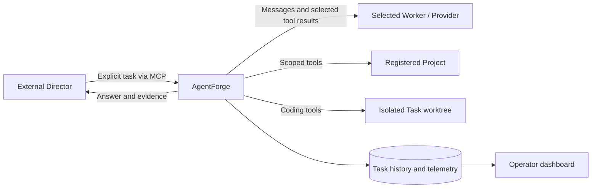

# AgentForge

AgentForge is execution infrastructure for agents directed by an external
orchestrator. It lets a Director delegate read-only analysis, repository exploration
or isolated coding work to an explicitly selected inference Worker, then inspect durable
results, evidence and telemetry.

Use it when your Director needs controlled repository tools, multiple local or
remote inference targets, and an observable execution history. The Director stays
in charge of what runs, where inference goes and whether the result is acceptable.
AgentForge does not automatically route, rank, replace Workers or choose a winner.

## How it fits together

| Role | Responsibility |
| --- | --- |
| **Director** | External orchestrator, such as Codex or another MCP client. Chooses Project, Agent, Worker and request; evaluates answers and accepts changes. |
| **AgentForge** | Central execution host. Validates bindings, enforces tool boundaries, manages Tasks/worktrees and persists history. |
| **Agent** | Behavior, allowed tools and runtime limits. Shipped Agents are `general_agent`, `repo_explorer` and opt-in `coder`. |
| **Worker** | Configured inference target: model, Provider connection, capabilities and deployment label. It has no direct repository or unrestricted shell access. |
| **Provider** | Inference protocol adapter. Shipped protocols are Ollama and OpenAI-compatible text/tool Chat Completions. |



A **Project** is an explicitly registered existing local directory with a stable
UUID and recorded filesystem identity. Git is optional for exploration. A cached
**Project Index** extracts Python symbols and relationships without executing
source; source tools provide evidence when the cache is stale or incomplete.

A **Task** durably binds Project/Agent/Worker/request and runs under bounded
steps, time, tool output and context. Terminal **telemetry** records observed
usage/timings and coverage; missing measurements stay unknown. Comparisons do not
rank or recommend Workers.

A **Council** runs the same request independently on 2–16 distinct Workers chosen
by the Director, retaining every answer and failure. There is no local judging,
consensus or answer sharing. Council Agents are read-only.

The opt-in **coding Agent** edits bounded UTF-8 files and runs named trusted
validators in its own worktree, based on committed HEAD. Dirty primary changes
are preserved. Workspaces remain for review and explicit cleanup. Runtime coding
does not commit, push, merge or create PRs.

## Choosing an Agent

The Director explicitly selects the Agent and Worker; there is no automatic routing
or fallback. `agentforge agent list` and MCP `list_agents` expose the same shipped
definitions. Defaults are `general_agent`, then `repo_explorer`; enabling coding
adds `coder`.

| Agent | Purpose | Representative tasks |
| --- | --- | --- |
| **General Agent** (`general_agent`) | Broad read-only analysis, comparison and synthesis of supplied context and project-local evidence. | Summarize the deployment model from README and architecture docs; compare three configurations; turn setup docs into a checklist; identify contradictions in local notes; summarize documented Windows support. |
| **Repo Explorer** (`repo_explorer`) | Code/repository investigation with precise implementation evidence and cached Python structure navigation. | Trace Task cancellation; follow a function's dependencies; find the implementation and tests for `git_diff`. |
| **Coder** (`coder`, opt-in) | Isolated controlled modification and named validation. | Edit a configuration or implementation and run an operator-configured validator in a separate worktree. |

General Agent uses only `list_files`, `read_file`, `search_code` (literal text search,
including documentation), `git_status` and `git_diff`. Its Project is supporting
context: it may answer entirely from the supplied Task text when sufficient. It
does not need a populated Project Index. Repo Explorer also has Python symbol/map
and relationship tools plus Git-index search for code investigation. Both read-only
Agents cite inspected project evidence and distinguish facts from inference.

General Agent has limits of 8 model turns, 90 seconds, 12 tool calls, 12,000 bytes
per tool result, 48,000 total tool-result bytes and 24,000 approximate context tokens
(also capped by the selected Worker's context window). All file access uses existing
registered-root authorization, sensitive-path filtering and bounded UTF-8 text tools.
It cannot write, execute code, use a shell, access the external network, select
Workers, delegate or expand permissions. A Worker configured without tool support
is rejected even for a request that needs no tools; there is no no-tool fallback.
General Agent is valid for independent read-only Councils without answer sharing
or local judging/synthesis.

A registered Project ID remains required, even for supplied-context-only analysis.
Project-less Tasks are a future design question. This feature adds no research/web
tools, routing/planning, subagents, memory/RAG or schema changes.

Use ordinary MCP delegation with explicit discovered IDs, for example:

```json
{
  "project_id": "<registered UUID>",
  "agent_id": "general_agent",
  "worker_id": "local-4080",
  "task": "Read README.md and the architecture docs and summarize the deployment model, citing the documents and noting gaps."
}
```

Worker diagnostics separate declared capabilities, cheap health, synthetic inference
observations and historical Task telemetry. Use `agentforge worker probe --help`
for an explicit small generation/tool/streaming probe and `worker diagnostics`
for persisted evidence. The dashboard never probes on load. Remote probes send
fixed synthetic data and can incur cost. See [Worker diagnostics](docs/worker-diagnostics.md).

## Install and quick start

Requires Python 3.12+ and a reachable, operator-configured inference endpoint with
a model supporting native tool calls. Linux supports descriptor-based repository
operations; native Windows supports ordinary fixed local NTFS. Git tools require
Git, and isolated coding requires an ordinary committed SHA-1 repository. No GPU
is required on the AgentForge host when inference runs elsewhere.

From a source checkout:

```sh
git clone https://github.com/tinuvael/AgentForge.git
cd AgentForge
python -m venv .venv
source .venv/bin/activate
python -m pip install -e .
cp config/workers.example.toml workers.local.toml
```

In Windows PowerShell activate with `.venv\Scripts\Activate.ps1` and copy with
`Copy-Item config/workers.example.toml workers.local.toml`. You can also install a
built wheel with `python -m pip install dist/agentforge-0.1.0-py3-none-any.whl`;
migrations and web assets are included. [Development](docs/development.md)
explains building it.

Edit `workers.local.toml` for your installed model and reachable endpoint. The
minimal supported Ollama configuration is:

```toml
[[workers]]
id = "local-4080"
provider = "ollama"
endpoint = "http://127.0.0.1:11434"
model = "gpt-oss:20b"
supports_tools = true
context_window = 32768
```

The Worker ID is just a name; no RTX 4080 or localhost deployment is assumed.
`supports_tools` is operator configuration, not a compatibility probe. For named
connections, multiple Providers or authenticated remote endpoints, start with
[workers.providers.example.toml](config/workers.providers.example.toml) and
[Provider configuration](docs/providers.md). It includes OpenAI-compatible
`/v1` endpoints and credential **environment-variable names**, never real secrets.
Explicit remote Worker selection sends gathered repository evidence to that endpoint.

Initialize a fresh database explicitly using the
[0.1.0 schema baseline](docs/development.md#migrations), then register exactly the
existing directory you intend to authorize. This example registers this checkout:

```sh
agentforge db upgrade --database-url sqlite:///agentforge.db
agentforge project add . --name AgentForge --database-url sqlite:///agentforge.db
agentforge project list --database-url sqlite:///agentforge.db
```

`project add` returns a Project UUID. Copy it from `registration.project_id` for
subsequent commands. Registration does not index source; optionally refresh the
Python Index using that UUID:

```sh
agentforge project index <PROJECT_UUID> --database-url sqlite:///agentforge.db
```

Validate setup before starting a service:

```sh
agentforge db status --database-url sqlite:///agentforge.db
agentforge worker config-check --workers workers.local.toml
agentforge worker list --workers workers.local.toml
agentforge agent list
```

For an explicit bounded Ollama model-availability check, run
`agentforge worker check local-4080 --workers workers.local.toml`.
OpenAI-compatible connections report `not_probed`; their current contract cannot
verify generic backend/model availability. Config validation and listing perform
no network probes. See `agentforge --help` and the
[operator command guide](docs/operator-cli.md) for administration and exit codes.
The installed wheel includes the CLI, migrations and web assets; it does not need
the source checkout. To create Worker configuration without the example files,
save the minimal TOML shown above to `workers.local.toml` and edit it.

Configure your MCP client to launch:

```sh
agentforge mcp --database-url sqlite:///agentforge.db --workers workers.local.toml
```

Use absolute interpreter/config/database paths in client settings; relative paths
use the server's working directory. [MCP setup](docs/mcp.md) has a client JSON example.
MCP uses stdio, so launching the command in a terminal waits for a client protocol
session. There is no HTTP MCP listener or interactive terminal REPL.

Discover with `list_projects`, `list_workers` and `list_agents`. Then call
`delegate_task` with actual discovered IDs:

```json
{
  "project_id": "<registered UUID>",
  "agent_id": "repo_explorer",
  "worker_id": "local-4080",
  "task": "Inspect the entry points and explain the execution flow with source citations."
}
```

Submission returns a queued Task ID. Poll `get_task` until terminal or explicitly
call `cancel_task`. For independent opinions, use `delegate_council` with explicit
`worker_ids`. The Director decides whether the evidence is sufficient.

To view the dashboard, stop the MCP executor first and run:

```sh
agentforge web --database-url sqlite:///agentforge.db --workers workers.local.toml
```

Open `http://127.0.0.1:8765` for Projects, Workers, Task/Council history, telemetry,
live metadata and confirmed cancellation. It uses Jinja2, vendored HTMX and SSE,
with no frontend build or CDN. The dashboard observes work; it has no task
submission UI. **Use one executor process per database**, including smoke scripts.
The shipped CLI does not host MCP and dashboard together.

For coding, create a private workspace parent **outside registered repositories**
and edit [coding.example.toml](config/coding.example.toml) with absolute real Git
and validator executables. Add `--coding config/coding.local.toml` to the chosen
server command, then discover/select `coder`. Before startup, run
`agentforge coding show --coding config/coding.local.toml` and
`agentforge coding check --coding config/coding.local.toml --database-url sqlite:///agentforge.db`.
These inspect configuration and host access without running validators. Validators
are optional and must be installed/configured by the operator. See
[coding](docs/coding.md) for portable
paths, write preconditions, validation trust, diffs and cleanup. Export/review
uncommitted changes before `cleanup_coding_workspace` discards them; retaining the
branch does not retain the worktree's uncommitted edits.

## Security, privacy and maturity

Repository/tool execution is centralized and allowlisted. Identity-checked roots,
no-follow access and bounded outputs reject path escape and ordinary replacement
races. Sensitive filenames are filtered, but this is not secret classification
or DLP. Provider credentials remain adapter-private. Raw reasoning stays in memory;
Task requests and intentional final answers are stored and may contain source or
secrets. Protect the database, configuration, installation and runtime storage.
For deployments, keep private state outside registered repositories.

**Validation commands are trusted host execution, not an OS or network sandbox.**
They can execute model-edited repository code, read host files and access the
network. Fixed argv, environment filtering and process cleanup do not contain a
hostile validator or enforce primary-checkout protection on its own program logic.

MCP is trusted local stdio. Dashboard loopback binding, CSRF and Host checks do not
supply authentication. Protect any intentional LAN exposure with a trusted
network/VPN or authenticated reverse proxy. Remote/cloud Workers receive context,
source/tool results, diffs and validation output gathered during their selected
execution. Consider endpoint trust and retention before selecting them.

This is the first implementation / initial release candidate, pending real
Windows/Ollama/GPU acceptance testing. Automated tests use synthetic repositories and mocked
inference, with no live network, cloud API or GPU. Native Windows tests are skipped
on Linux; mocks do not establish physical Windows validation. Windows rejects UNC,
reparse/junction paths, hardlinks, ambiguous aliases and unsupported volumes.
Coding rewrites on Windows are not crash-atomic. See
[Windows security](docs/windows-repository-security.md) and
[acceptance procedure](docs/native-windows-smoke.md).

Current limits include one process per SQLite database, conservative Python-only
structural indexing, bounded small-repository coding/Git snapshots, no history
retention policy, no remote authentication platform, no general REST API and no
combined MCP/dashboard CLI. Context sizing is approximate. Remote generation may
continue after local cancellation; forced process loss leaves interrupted work
for explicit review/recovery.

## Documentation and development

- [Operator setup and administration](docs/operator-cli.md)
- [Worker diagnostics and explicit probes](docs/worker-diagnostics.md)
- [Architecture and ownership](docs/architecture.md)
- [Projects, Python Index and read-only tools](docs/repository.md)
- [Tasks, lifecycle and telemetry definitions](docs/tasks.md)
- [Providers, credentials and data egress](docs/providers.md)
- [MCP contracts and client setup](docs/mcp.md)
- [Dashboard operation and exposure](docs/dashboard.md)
- [Independent Councils](docs/councils.md)
- [Coding worktrees, writes, validation and recovery](docs/coding.md)
- [Security policy and trust boundaries](SECURITY.md)
- [Offline development/release validation](docs/development.md)
- [Opt-in Repo Explorer acceptance](docs/manual-repo-explorer.md)

Use `python -m pip install -e '.[dev]'`, then `python -m pytest -ra`,
`ruff check .`, `ruff format --check .`, `git diff --check` and `python -m build`.
Follow [AGENTS.md](AGENTS.md) for contribution/Git rules. AgentForge is licensed
under [GPL-3.0-only](LICENSE).
