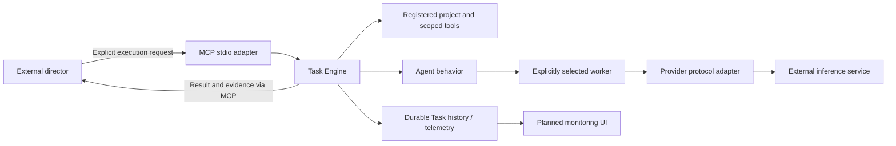
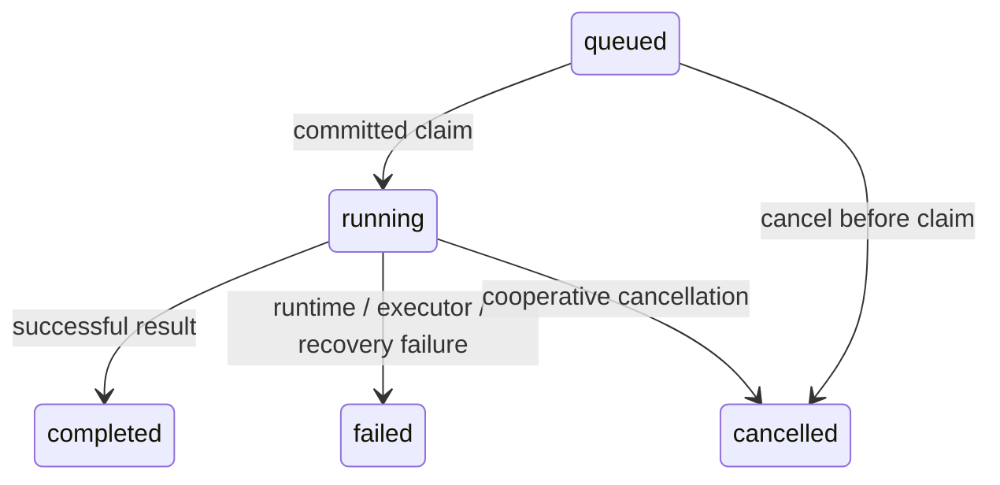
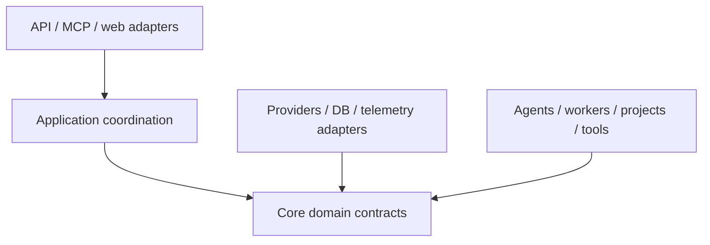

# AgentForge architecture

## Status and purpose

Phase 01 established the architectural contract and package skeleton. Phase 02
implements Provider contracts, validated Worker configuration and the Ollama HTTP
adapter, including health, generation and streaming. Phase 03 implements the
Project Registry, SQLAlchemy persistence and the initial Alembic migration.
Issue #14 adds a deterministic Python Project Index and compact repository map.
Phase 04 adds bounded, read-only repository tools. Phase 05 adds generic Agent
behavior and bounded in-process execution, starting with `repo_explorer`. Phase 06
adds durable Tasks, controlled lifecycle and a bounded in-process Task Engine.
Phase 07 adds terminal Task telemetry, normalized backend timing observations and
transport-independent comparison queries. Phase 08 adds the typed MCP stdio
adapter and shared application composition/lifecycle. Issue #23 adds a native
Windows NTFS security backend for central repository/Index execution. Phase 09
adds the local Jinja2/HTMX dashboard and bounded live metadata observation.
General API endpoints remain **planned**.

AgentForge is a generic agent execution/runtime platform. It supplies projects,
providers, workers, agents, tasks, tools, telemetry, an MCP interface and a web
monitoring UI. It is not an intelligent task router in v1.

## System boundary and director

An external strong model such as Codex/Astra/Sol/Claude is the director/orchestrator.
It chooses the project, agent and worker, supplies the request, judges whether the
result is sufficient, and decides whether another worker should be consulted.
AgentForge validates and executes explicit requests and returns results and
execution evidence. It must not silently select a different worker or judge which
model answer is best. Validation rejects invalid or unauthorized requests; it is
not a routing decision.



Inference services, registered repositories and the director sit outside the core
runtime boundary. Repository content is external data, even when stored locally.
The dashboard observes execution; it does not become the director.

## Domain contract

| Concept | Meaning | Example |
| --- | --- | --- |
| Provider | Protocol/backend used to communicate with an inference service | Ollama, llama.cpp, OpenAI-compatible HTTP |
| Worker | Concrete configured inference target: provider, endpoint, model and machine context | Ollama at a configured local endpoint, `gpt-oss:20b`, RTX 4080 |
| Agent | Behavior layered on the selected worker | `repo_explorer`, `code_reviewer`, `test_triage`, `general` |
| Project | Registered external repository/workspace with context and access boundaries | A repository identified in the Project Registry |
| Task | Durable execution request binding project, agent, worker and request | Review a change using explicit registered IDs |
| Council | Future independent executions of the same problem on explicitly selected workers | Return every worker's result to the director |

Provider handles protocol details, Worker identifies where and which model runs,
and Agent defines behavior. Agents must not embed provider endpoints or choose
workers autonomously. Multiple workers may share a provider; a provider is not a
singleton model or machine. Machine context describes the target deployment, not
a hardware scheduling subsystem.

The eventual first deployment is RTX 4080 → Ollama → `gpt-oss:20b`. It is one worker
configuration, not a core assumption. Later configurations may use Ryzen AI Max+
395 with a large local model, other local inference servers, free or paid cloud
models, or arbitrary OpenAI-compatible endpoints.

## Components and repository layout

| Package under `src/agentforge/` | Responsibility |
| --- | --- |
| `application/` | Shared composition, lifecycle and typed director-facing operations |
| `core/` | Provider/Worker inference domain contracts |
| `tasks/` | Durable Task lifecycle, explicit execution binding and bounded scheduling |
| `projects/` | Project Registry: stable project identity, repository/workspace location, context and permitted operations |
| `index/` | Deterministic Python structure, explicit refresh, graph queries and bounded textual maps |
| `providers/` | Ollama inference adapter; translate calls and failures for the backend |
| `workers/` | Validated configuration loading for concrete inference targets |
| `agents/` | Agent behavior, bounded in-process execution and typed Project-bound tool wrappers |
| `tools/` | Repository operations constrained by project roots and permissions |
| `telemetry/` | Execution events, timing, errors and available usage observations |
| `db/` | SQLAlchemy persistence and Alembic migrations, using SQLite initially |
| `api/` | FastAPI transport adapter to application operations |
| `mcp/` | MCP Python SDK adapter exposing explicit operations to the director |
| `web/` | Jinja2 templates and HTMX monitoring interactions |

`tests/` holds pytest tests; `docs/` holds durable architecture documentation.
Packages other than `core/`, `providers/`, `workers/`, `projects/`, `index/`,
`tools/`, `agents/`, `tasks/`, `telemetry/`, `application/`, `mcp/`, `web/` and `db/`
remain placeholders. Alembic configuration and revision scripts live in `alembic.ini` and `migrations/` at the
repository root.

### Provider and Worker foundation (Phase 02)

`core.inference.Provider` is a single structural Python protocol:

- `health(worker) -> WorkerHealth` is async and observes backend connectivity and
  configured model availability separately. It is a snapshot, not persisted state
  or a guarantee that the next generation succeeds.
- `generate(worker, request) -> GenerationResult` is async.
- `stream(worker, request)` returns an async context manager containing an async
  iterator of `GenerationChunk` values. Content is a delta, and a terminal chunk
  has `done=True` and any available final metadata.

All operations require an explicitly supplied Worker. There is no provider
registry, worker selection, routing or fallback. Future callers can accept the
protocol without importing the concrete Ollama adapter.

`core.worker.Worker` is a validated configuration model containing ID, provider
name, model, HTTP(S) endpoint, optional context window and deployment label,
configured streaming/tool-use capabilities, timeout and provider options. Unknown
tool-use support is `None`; streaming defaults to disabled until configured.
Phase 05 uses the configured tool capability: explicit `False` rejects a tool-using
Agent; `None` permits an attempt without claiming observed support.
Endpoints cannot embed credentials, queries or fragments. `WorkerHealth.available`
requires both backend connectivity and observed model availability.

`GenerationRequest` contains conversational messages, an optional prepended system
instruction, optional temperature, provider options and optional timeout override.
Phase 05 adds normalized structured tool calling and opaque assistant reasoning
state for protocol/history preservation, described below. Multimodal input remains
unsupported. Results contain content, model identity, optional finish reason,
normalized token usage and optional
`GenerationTiming` backend durations in seconds. Optional provider-specific
usage/timing dictionaries remain for backward compatibility. Raw Ollama
token counts retain their API names, and duration values retain their API names and nanosecond units;
missing observations remain absent rather than estimated.

`providers.ollama.OllamaProvider` uses httpx with `/api/chat` for generation and
newline-delimited JSON streaming, and `/api/tags` for health/model presence checks.
Each operation owns and closes its HTTP client; streaming also owns the response
and iterator. Incomplete or malformed responses raise `InvalidProviderResponse`;
connectivity failures raise `BackendUnavailable`, timeouts raise `ProviderTimeout`,
and HTTP/model rejections raise `ProviderRejected` with an optional HTTP status.
Error messages omit backend bodies, endpoint secrets and input payloads. Health
reports safe error codes instead of raising backend failures; invalid adapter/Worker
pairings are rejected before HTTP work.

Callers must consume streams inside `async with`. Exiting the block closes the
HTTP request on completion, early break, caller error or cancellation. Cancelling
the executing asyncio task propagates `CancelledError` and closes local resources.
Ollama offers no task-ID cancellation primitive here: closing the request does not
guarantee that remote generation has stopped. Task Engine shutdown preserves this
local cleanup boundary; ordinary Task cancellation uses the runtime token.

The Worker timeout defaults to 120 seconds; request overrides apply to generation
and streaming. It is a total wall-clock execution budget as well as an HTTP I/O
timeout, with connection attempts capped at 10 seconds. For streaming, this budget
includes caller processing within the context block. Health is bounded by the
smaller of five seconds and the Worker timeout.

`workers.config.load_workers(path)` reads one explicitly supplied TOML file into
`WorkersConfig`, validating each Worker and rejecting duplicate IDs/unknown fields.
Multiple Workers can share one provider implementation. There is no automatic
config discovery, environment loader or plugin framework. Phase 08 adds explicit
application wiring with a database URL and Worker configuration file.
`config/workers.example.toml` defines the illustrative `local-4080` target; it is
not loaded by default. Worker options are merged with request options, then a known
Worker context window sets Ollama `num_ctx`, and explicit request temperature takes
precedence. The model and endpoint always come from the supplied Worker. Secrets
belong in local secret configuration; authentication integration is deferred.

Tests use httpx mock transports and fake byte streams. A suite-wide guard rejects
live network connections and DNS resolution, so no GPU, Ollama or Internet is
needed to run them.

### Project Registry and persistence (Phase 03)

`projects.models.Project` is immutable configuration: a generated UUID, a
human-readable name, a canonical absolute local root and a UTC creation timestamp.
Names may repeat; canonical roots may not. Identity does not depend on a mutable
name or path. A normal directory is a valid project; Git is optional. Core contains
no project-specific assumptions.

`projects.service.ProjectRegistry` exposes synchronous, transport-independent
`register_project(name, root_path)`, `list_projects()`, `get_project(id)`,
`remove_project(id)` and `inspect_project(id)`. IDs accept UUIDs or UUID strings.
Removal deletes registration and its cached index, never repository files.
Configuration remains retrievable/removable when its directory is unavailable;
inspection validates that the root still exists.
Important failures have explicit `ProjectError` subclasses, including invalid
paths/names, duplicate roots, missing IDs, unsafe candidates and storage failures.
SQLAlchemy errors and database statements are not exposed as service errors.

Relative registration paths use the registry's explicit `base_directory`, or the
working directory captured at construction. POSIX registration follows symlinks
and requires an existing directory, so aliases of the same directory collide.
Windows registration rejects every reparse ancestor and ambiguous namespace/path
construct. The stored canonical root is the security boundary.
`resolve_path(id, candidate)` delegates to the platform backend. The original
POSIX `projects.paths.resolve_project_path` helper resolves existing candidates
and checks `Path.is_relative_to` against the resolved root. Windows validates
relative components and opens them under identity-checked, pinned ancestry;
absolute candidates and reparse aliases are denied. A stored root replaced by a
symlink to another location is rejected. These helpers return point-in-time paths,
not I/O capabilities. Phase 04 adds `open_root(id)` for descriptor-anchored POSIX
access and persists directory device/inode identity. Windows uses the same
Registry entrypoint with opened handles and volume/file identity. Migration
`0003_project_root_identity` leaves POSIX fields null for
legacy registrations: live Registry inspection, Index refresh/status scans and
repository tools fail closed until those projects are removed and re-registered.
Configuration retrieval/removal and cached Index queries remain available.
Migration never observes or authorizes a replacement directory. Creation semantics
for nonexistent paths remain unimplemented.

`inspect_project` returns `ProjectInspection(project, git)`. `GitMetadata` is a
fresh, nonpersisted observation with an observation timestamp, discovery status,
repository/worktree root, optional branch and optional HEAD commit. Status is
`repository`, `not_repository` or `unavailable`; unavailable discovery does not
assert that the directory is non-Git. Detached HEAD has no branch; an unborn
repository has no commit. Git failures/timeouts are best effort and do not prevent
registration. `inspect_project` first opens the identity-checked registered root
through `open_root`; boundary failures propagate Project errors, not best-effort
Git metadata. Inspection uses bounded, read-only `rev-parse`/`symbolic-ref` calls
with the verified descriptor inherited as Linux `/proc/self/fd` cwd, a sanitized
Git environment, disabled optional locks and no network or repository mutation.
On POSIX without descriptor-backed Git cwd, Git is observationally `unavailable`;
no pathname fallback may inspect a replacement. Windows instead copies approved
Git metadata and Project working files through locked handles into a pinned,
bounded private snapshot, then executes the same fixed Git commands there.
Separate reads are not an atomic snapshot of a concurrently changing repository.
An observed Git root may be an
ancestor of a registered subdirectory; it never expands the approved boundary.

`db.database` owns explicit SQLAlchemy 2 engine/session construction;
`db.models.ProjectRecord` owns the `projects` table. `db.projects.ProjectRepository`
maps records to domain values and owns short-lived sessions/transactions, a unique
canonical-root constraint and error translation. The service currently uses this
small concrete storage adapter; domain models, path helpers and Git inspection
have no SQLAlchemy dependency. No generic repository framework is introduced.
SQLite is the initial backend; UUID and timezone-aware timestamp columns use
SQLAlchemy types. SQLite timestamps are interpreted as UTC when read.

Schema changes are explicit Alembic operations, never registration/startup side
effects. From the repository root in the development venv:

```sh
alembic upgrade head
alembic revision --autogenerate -m "Describe the schema change"
alembic check
```

`alembic.ini` defaults to the ignored local `agentforge.db`; set `sqlalchemy.url`
in a local Alembic configuration for another database. Pass the same URL to
`create_database_engine`, then wire `create_session_factory(engine)` →
`ProjectRepository` → `ProjectRegistry`. Dispose the engine when its owner shuts
down. The initial revision creates only project configuration. Tests migrate
temporary SQLite databases and verify upgrade/downgrade and database reopening.

Project-specific configuration stays with registry entries, separate from generic
runtime behavior. Architecture summaries remain deferred.

### Deterministic Project Index (Issue #14)

`index.service.ProjectIndex` consumes the existing `ProjectRegistry` and
`db.index.IndexRepository`. Wire both repositories with a session factory for the
same migrated database. The service is synchronous and transport-independent:
`refresh_index(id)`, `get_index_status(id)`, `find_symbol(id, query)`,
`get_symbol(id, symbol_id)`, `get_dependencies`, `get_dependents`,
`get_related_symbols`, `get_relationships` and
`render_project_map(id, focus=None, max_tokens=3000)`. Index operations themselves
involve no HTTP/MCP adapter or Worker; the Phase 05 Agent wrappers consume these
public queries for structural navigation.

The boundary is Python bytes → built-in AST → small immutable extraction records
→ SQLite → queries/maps. `index.python_parser` owns definitions, line locations,
lexical containment and import/call facts; it never executes source. Its
`parse_python(relative_path, bytes) -> ParsedFile` boundary allows another parser
later without a plugin framework or storage redesign. `index.scanner` uses shared
`projects.backends` platform capabilities and `projects.exclusions` for safe
reads/traversal.
`db.index` owns transaction-scoped replacement and link
resolution; `index.render` owns deterministic relevance and bounded rendering.
No LLM, embeddings, vector database or graph library builds structural facts.

Alembic revision `0002_project_index` follows the shipped `0001_projects` revision.
Four small tables store project snapshot metadata, eligible files, symbols and
relationships. Files carry observed and last successfully parsed SHA-256 hashes;
raw source/bodies are not persisted. Module symbols act as containment roots and
import targets; only unambiguous, unshadowed module-level definitions are eligible
definition import targets. Definition IDs hash the relative path, kind, lexical
qualified name and start line, so duplicate and nested definitions stay distinct.
IDs can change when definitions move. IDs are scoped to a Project, with no
cross-project semantic identity. Module names follow paths relative to the
registered root, with package `__init__.py` mapped to its directory. A root
initializer uses the display namespace `__root__`, without assuming an absolute
package name; its relative imports of indexed child modules can still link.
The index does not infer Python installation layouts, `sys.path` or `src/` roots.

Refresh explicitly scans `.py` files one at a time, compares content hashes and
reuses unchanged extraction records. New/changed files replace their structure;
deleted files are removed. Import links are recomputed from cached facts against
the complete current symbol set, including unchanged importers. A fresh registry
Git observation records HEAD when available, but never determines freshness:
dirty working trees and non-Git projects use the same hash checks.
`get_index_status` performs an explicit live hash scan and reports changed paths,
counts, snapshot time, observed HEAD and parse failures. Other queries read cached
structure; callers check status or request refresh when they need current data.

One database transaction covers the complete refresh. Filesystem, unexpected
parser or storage failures roll back all changes. Invalid Python syntax/encoding
is a per-file failure: its observed hash and a safe diagnostic are stored, while
its previous valid symbols/relationships remain available, flagged `stale` and
marked in maps. A newly invalid file has no structural records. Unchanged invalid
files retain their diagnostic without reparsing; edits retry parsing. Status keeps
reporting these failures, so a partial index is never presented as fully current.
SQLite connections enable foreign keys and transaction control covering reads;
cascades clean file-owned facts and all index tables when the registry removes a
Project. Resolved target IDs are checked and rebuilt transactionally rather than
defining a generic graph ORM.

The Registry's `open_root(project_id)` is authoritative for both Index filesystem
operations and repository tools: it validates the canonical root and its persisted
platform filesystem identity. `ProjectIndex._scan` keeps that context open while
its scanner consumes the verified directory capability. Windows retains handles
for every ancestor before full-path child opens; POSIX keeps descriptor-relative
opens. Refresh consumes the scan, including root exit validation, inside the database transaction
so replacement during parsing rolls back changes. `inspect_project` checks the
same identity before refresh's Git observation. Legacy NULL identity rows require
re-registration for live refresh/status scans; cached symbols, relationships and
maps need no live root authorization and remain queryable.
Traversal skips **all** symlinks (including internal aliases), special
files and fixed cache/build/vendor/IDE/secret directories, including `.git`, virtual
environments, `site-packages`, `node_modules`, `dist`, `build`, `vendor`,
`third_party` and `.secrets`; no configurable ignore engine is added. POSIX
no-follow descriptors anchor root ancestors, directory traversal and regular-file
reads, closing the validation/I/O symlink race. Windows uses no-follow NTFS handles
with write/delete sharing denied and the same automatic policy, case-insensitively,
including sensitive paths. Python source reads are capped at 2 MiB; exceeding the
cap rolls back refresh. Unsupported capabilities fail closed.
Root/directory replacement and changes during a file read abort refresh. The
repository is strictly read-only, and index operations never access the network.
As with Git inspection, a changing filesystem is not an atomic source snapshot;
explicit hash checks/refresh detect subsequent edits.

Relationships retain their kinds and direction: `contains`, `imports`, `calls`.
Dependencies are outgoing resolved edges, dependents incoming resolved edges, and
related symbols return their union as typed edges. `get_relationships` also exposes
unresolved textual imports/simple calls with a null target. Imports link only
unambiguous root-relative indexed modules/definitions; external imports, wildcards,
unknown exports and ambiguous names are not guessed. Call links describe syntactic
lexical targets, not guaranteed runtime dispatch: unique plain local definitions
and straightforward `self.method()` within a plain class without bases, metaclass,
class decorators or custom attribute lookup. Parameters, assignments,
imports, duplicate/conditional/decorated definitions and explicit receiver/method
rebinding block uncertain links. Arbitrary `obj.method()`, inherited dispatch,
imported-alias calls, lambdas/comprehensions, dynamic exports, monkeypatching and
full type inference are deliberately unsupported. No general reference analysis
or graph path operation is implemented. `find_symbol` returns all case-insensitive
exact simple/qualified matches, falling back to qualified-name substrings; it never
selects one ambiguous definition silently.

Maps contain paths, classes/functions/methods and start lines, without bodies or
AI summaries. Focus ranks exact names, qualified names, substrings/path matches
and direct import/call neighbors. General maps use relationship degree, top-level
definition counts and shallow paths before stable lexical tie-breaks. Rendering
uses whole structural lines, with necessary parent context, and a strict UTF-8
byte cap of `3 * max_tokens`; `ceil(bytes / 3)` is the documented approximate token
estimator, not a model-tokenizer guarantee. Zero or too-small budgets return an
empty map; negative/noninteger budgets are rejected. Future repository tools and
local agents may request exact source regions from these paths/line spans. Future
architecture summaries may consume these deterministic facts. The Index itself
does not execute Tasks, route Workers or generate architecture summaries.

### Tasks and repository tools

The Task Engine validates explicit bindings, persists execution requests and
lifecycle state, coordinates bounded execution, and makes outcomes retrievable.
See [Phase 06](#task-engine-and-durable-history-phase-06) for lifecycle and recovery.
Infrastructure errors are reported to the director; automatic model fallback
would violate explicit worker selection.

`tools.service.RepositoryTools(ProjectRegistry)` supplies synchronous,
transport-independent `list_files`, `read_file`, `search_code`, `git_grep`,
`git_status` and `git_diff`. Every operation requires a registered Project UUID;
there is no arbitrary root/path API, generic command runner, shell, write tool,
MCP wrapper or execution loop inside the service. Phase 05 wraps these methods
without duplicating their implementations. Tools do not require a refreshed index.
The Index supplies symbols, relationships and maps; tools supply exact source and Git state.

Filesystem authorization remains the registry's canonical Project root, using
`open_root(id)` and a shared platform security backend for root ancestors, traversal
and regular-file reads. Paths must be project-relative; absolute paths, `..`,
backslashes, drive/pathspec syntax and control characters are rejected. Tools
reject all symlinks (including internal aliases), directories as file reads and
special files. File changes during reads and directory/root replacement fail
closed, including early traversal termination at a result limit. Persisted
device/inode (POSIX) or volume/file (Windows) identity catches ordinary root
replacement across service/database reopening. Containment uses path components
and opened identity, never string-prefix comparisons.
POSIX uses no-follow descriptors; Windows uses local NTFS handles and denies reparse
points, ambiguous path constructs and conflicting write/delete access. Unsupported
systems fail closed.
Privileged mount manipulation and inode reuse are beyond this filesystem boundary.

Automatic listing/search reuse the Index's fixed generated/cache/vendor directory
exclusions. There is no configurable ignore engine. They additionally omit a small,
case-insensitive sensitive-path policy: `.env`, all `.env.*` (including examples),
`.secrets`, `.ssh`, `.aws`, `.gnupg`, `.git`/`.hg`/`.svn`, `.netrc`, `.npmrc`,
`.pypirc`, `credentials.json`, common `id_rsa`/`id_dsa`/`id_ecdsa`/`id_ed25519`
key names, and `.pem`/`.key`/`.p12`/`.pfx` suffixes, anywhere under the root.
Explicit reads may inspect otherwise excluded generated files, but sensitive
paths are always denied by every tool, without content in errors. This is
conservative defense-in-depth, not secret classification or DLP.

File reads accept optional inclusive 1-based start/end lines and return requested
and returned ranges, text and a truncation flag. Decoding is strict UTF-8 with
control-character rejection (except tab/CR/LF); no encoding guessing, tokenizer,
base64, media extraction or execution occurs. A bounded prefix is inspected,
so this is not a claim that an unseen tail is textual. Listings and searches have
stable lexical path/line ordering. `search_code` is literal, optionally casefolded,
and supports directory scope and a `fnmatchcase` glob over relative paths;
non-text files are skipped and counted. Snippet truncation is explicit on each
match; result truncation means the requested scan/output could not be completed.

| Budget | Default | Hard upper bound |
| --- | --- | --- |
| Returned UTF-8 bytes (all potentially large tools) | 64 KiB | 1 MiB |
| File listing / Git status entries | 1,000 | 10,000 |
| Returned file lines | 1,000 | 10,000 |
| Search / Git grep matches | 100 | 1,000 |
| Matching-line snippet bytes | 500 | 2,000 |
| Inspected source/index blob prefix per file | 2 MiB | fixed 2 MiB |
| Files / bytes inspected by filesystem search | 100,000 / 64 MiB | fixed |
| Changed paths considered by a diff | 100 | fixed |
| Lines compared per file in an unstaged diff | 10,000 | fixed |
| Git metadata capture / stderr capture | 64 KiB / 8 KiB | fixed |
| Git subprocess timeout | 2 seconds | fixed per subprocess |

Entry/match byte budgets account for paths as well as content. File range bounds
are limited to 1,000,000. Truncation is returned whenever a result, scan or diff
limit prevents completeness; incomplete oversized diff inputs are skipped rather
than treated as complete files. UTF-8 truncation never emits a split character.
Filesystem scans process one file at a time; directory names are sorted in memory.
Separate filesystem and Git observations are not an atomic snapshot.

Git tools require a Git worktree. Linux uses `/proc/self/fd` to pin subprocess cwd;
Windows uses an isolated bounded Git snapshot copied through authorized handles.
Absence, unavailable Git, timeout and backend failure are separate domain errors.
A private backend uses fixed explicit argv, `shell=False`, bounded concurrently
drained stdout/stderr, process-group termination and sanitized shared Git
configuration. Inherited `GIT_*` redirection is removed; global/system config,
optional locks, network transports, lazy fetch, pagers, fsmonitor, hooks, external
diff/textconv and submodule recursion are disabled. Configured clean/smudge/process
filters are discovered by name and overridden before worktree status. Git metadata
must remain stable during an observation; these calls are not an OS process sandbox
against another process concurrently rewriting Git configuration.

`git_grep` deliberately searches regular-file **index contents** with `--cached`,
not untracked or unstaged text, to avoid worktree symlink races. It accepts literal
queries and safe relative paths only, with no caller Git options/pathspec magic.
`git_status` parses NUL-delimited porcelain v1, disables rename expansion, and
returns branch/detached state plus staged, unstaged, untracked and conflict facts.
`git_diff(staged=True)` uses bounded Git patches with rename expansion disabled;
unstaged diffs compare validated indexed blobs against descriptor-safe working
files with stdlib `difflib`. Binary changes get a textual unsupported marker,
metadata-only changes a marker, and conflict/oversized input omission marks the
result incomplete. Symlink reads fail closed; submodule content is omitted.
There is no historical revision API, network access or repository mutation.

For registered `/repo/allowed` inside Git root `/repo`, every Git request has a
literal project-relative scope. Captured root-relative names are converted by
component containment, filtered by exclusion/sensitive policy and returned as
Project-relative paths. Grep/diff receive only eligible scoped paths; rename
expansion is disabled so a move across the boundary cannot reveal sibling content.
Git discovery never authorizes `/repo/secret`. Synthetic tests cover all three
Git tools on this subdirectory boundary and verify byte-for-byte read-only behavior.
Public errors reuse Project identity/path failures and add invalid argument,
missing file, unsupported text, sensitive path, I/O, non-Git, unavailable Git,
timeout and safe backend failure types; OS/SQL/Git stderr details are not exposed.

### Agent Runtime and Repo Explorer (Phase 05)

`agents.models.Agent` defines behavior (`id`, name, description, system prompt,
allowed tool names and default `RuntimeLimits`). It contains no endpoint, model,
Provider or Worker selection policy. Agent definitions and Workers are supplied
separately to `agents.runtime.AgentRuntime`, along with explicit Provider and tool
mappings and the existing Project Registry. There is no plugin loader. The caller
must supply `project_id`, `agent_id`, `worker_id` and `task` to `run()`; no Worker
argument has a default. The runtime looks up exactly that configured Worker and
its Provider. It never probes health for selection, routes, scores, retries on a
different model, or falls back when inference fails.

The runtime itself is async and in-process; Task Engine owns its durable lifecycle.
It uses non-streaming
`Provider.generate()`: system prompt + original task → assistant text and/or tool
calls → sequential validated tool results → next model turn → final answer.
Multiple tool calls in a turn retain their order and correlation IDs. Entire-turn
permission, ID uniqueness and tool-count checks happen before executing any tool.
An assistant turn with text and tools continues the loop; nonblank text without
tools completes it; an empty response terminates as `invalid_response`.
Streaming remains available on Providers; live Agent streaming is deferred.

The inference contract adds `ToolDefinition(name, description, parameters)` with
machine-readable JSON Schema, `ToolCall(id, name, arguments)` with JSON object
arguments, assistant `Message.tool_calls`, and tool-role Messages with
`tool_call_id` and `tool_name`. `GenerationRequest.tools` and
`GenerationResult.tool_calls` use these normalized types. `TokenUsage` contains
optional observed input/output counts. The runtime retains one optional usage
observation per successful model turn, rather than fabricating totals when some
counts are missing. Existing raw Provider usage/timing fields remain compatible.

`Message` (assistant role only), `GenerationResult` and `GenerationChunk` also
carry optional `reasoning: str | None`. This is opaque conversation state needed
by some backends across tool turns. AgentRuntime copies it into the corresponding
assistant history message and never interprets it as content, instructions, tool
calls or authorization. Provider adapters may round-trip it as required by their
protocol. Missing state remains `None`; no state is synthesized. Streaming preserves
reasoning deltas inside normalized chunks, without an Agent reasoning UI.
It contributes to context accounting but never becomes the runtime final answer,
trace content or sanitized error output. Only independently returned normal
assistant content can become a final answer. There is no reasoning telemetry or
persistence.

Ollama translates definitions into native `type: function` chat tools and parses
native `message.tool_calls[].function` objects. It never parses textual pseudo-tool
commands. Native Ollama generally omits call IDs and correlates tool results by
`tool_name`; the adapter creates unique local IDs when absent and preserves any
supplied IDs in normalized results. It sends assistant function objects and native
tool-role messages with `tool_name`. IDs remain intact inside the generic runtime;
Ollama's native wire correlation is isolated in the adapter, including sequential
results for repeated calls to the same tool. Ollama `message.thinking` is parsed as
normalized `reasoning` and serialized back as native assistant `thinking`, separate
from `content` and `tool_calls`, on subsequent requests. This preserves the history
required by thinking-enabled models, including the configured `gpt-oss:20b`, without
model-specific runtime logic. Missing/null thinking stays `None` and is omitted on
outgoing messages; an empty string is preserved. Non-string/non-null thinking is
rejected as a safe `InvalidProviderResponse`, without its value in the error.
Malformed function objects are safe Provider failures. Tool-use quality depends on
the configured model/Ollama
version; no `gpt-oss` workaround contaminates the runtime.

`agents.tools.repository_toolset()` explicitly maps twelve read-only tools:
`get_project_map`, `find_symbol`, `get_symbol`, `get_dependencies`,
`get_dependents`, `get_related_symbols`, `list_files`, `read_file`, `search_code`,
`git_grep`, `git_status`, `git_diff`. Each has its own strict Pydantic argument
model, disallows extra keys and validates safe syntax before service calls.
The Project UUID is bound by the execution request, never accepted in model tool
arguments. Only `Agent.allowed_tools` are advertised and authorized; unknown or
disallowed tools terminate as `tool_not_allowed`. No dynamic attribute lookup,
filesystem opening, shell, arbitrary Git, subprocess or network operation is
implemented in the wrappers. They reuse Project Index and RepositoryTools.

The Registry's identity-checked `open_root` is verified before model operations,
before/after authorized tool operations and before accepting a final answer.
RepositoryTools still owns platform-authorized filesystem/Git access. Cached
Index calls also require live root authorization in Agent execution. Index output
is filtered with RepositoryTools' sensitive-path policy so cached symbols cannot
bypass denied-file access; map rendering accepts an optional caller-side path
filter without changing existing unfiltered Index callers. Structural lookup
lists have explicit result counts and truncation metadata.

| Runtime limit | Default | Hard upper bound |
| --- | --- | --- |
| Model turns (`max_steps`) | 12 | 100 |
| Single overall deadline | 120 seconds | 600 seconds |
| Attempted authorized tool calls | 24 | 200 |
| Serialized individual tool result | 12,000 UTF-8 bytes | 65,536 bytes |
| Accumulated serialized tool results | 48,000 UTF-8 bytes | 524,288 bytes |
| Approximate conversation contribution | 24,000 tokens | 200,000 tokens |

The caller can supply validated per-execution limits; otherwise the Agent defaults
apply. Conversation capacity is also capped by a known Worker context window.
The deterministic approximation is `ceil(serialized UTF-8 bytes / 3)`, including
system prompt, original task, all assistant text and opaque reasoning state,
tool calls/arguments, tool results, correlation fields, JSON framing and advertised
schemas. This deterministic size heuristic is not a tokenizer-independent upper
bound; actual token counts depend on the model's tokenizer. It bounds serialized
conversation growth without guaranteeing fit in every model's token window. The
runtime checks the initial request and each appended contribution. It never
silently discards or summarizes evidence. Source bytes are additionally bounded by existing service
limits. Wrappers request at most half the remaining per-result/aggregate budget
for source output, reserving room for JSON escaping and metadata; the runtime then
checks the actual complete serialized result. Oversized JSON is rejected rather
than clipped. Less than 256 bytes remaining ends execution before another tool.
Repeated reads cannot grow conversation or accumulated output without bound.

Limit termination names are distinct: `max_steps`, `max_tool_calls`,
`tool_result_limit`, `tool_output_limit`, `context_limit`, `timeout` and
`provider_timeout`. One monotonic deadline includes the whole interaction;
inference receives `min(Worker timeout, remaining deadline)` and is additionally
wrapped in `asyncio.timeout`. The synchronous Index/RepositoryTools calls cannot
be interrupted mid-call: cancellation and elapsed time are checked at boundaries,
and Git retains its existing two-second per-subprocess timeout. A long synchronous
scan may therefore return after the Agent deadline, at which point its result is
rejected. No background tool work or executor pool is introduced.

`CancellationToken` wraps a thread-safe event. It is checked before/after model
calls, before/after tool calls and between iterations, returning structured
`cancelled` state. Token cancellation during an awaited inference operation is
observed when that operation returns or times out; callers needing immediate
interruption may cancel the asyncio execution task. `CancelledError` propagates
and Provider resource cleanup remains intact. Phase 06 connects Task cancellation
to the token and shutdown to asyncio cancellation without replacing the runtime.

Recoverable errors are bounded JSON objects with fixed safe codes: invalid
arguments or safe-path syntax, denied sensitive paths, missing files/symbols,
unsupported text/binary, repository I/O, non-Git, unavailable Git, Git timeout and
Git backend failure. The model may recover with another permitted query. Unsafe
identity/descriptor failures raised during service access are terminal
`security_error`; storage/unexpected service faults are terminal `tool_error`.
Provider faults are terminal with no fallback. Errors never serialize exception
messages, traceback, SQL, backend bodies or Git stderr. Invalid configuration,
cancellation and global limits also terminate. The registered root remains
fail-closed even when only cached navigation is requested.

`ExecutionResult` returns final answer (only on completion), Agent/Worker/Project
IDs, state, termination reason, step/attempted-call counts, accumulated output
bytes, observed usage and an in-memory ordered trace. The trace records model and
tool boundaries, call IDs, authorized names, validated argument shape with free
text redacted, success/fixed failure codes, result byte sizes, elapsed durations
and termination. It deliberately omits source bodies, assistant prose, reasoning
state, raw invalid arguments and backend diagnostics. Task Engine persists this
sanitized result/trace at termination; no metrics subsystem is implemented.
This is execution evidence, not Phase 07 telemetry.

`repo_explorer` requires inspecting evidence before repository claims, treats the
Index as cached navigation rather than source truth, asks for exact source/tests
with focused queries, distinguishes evidence from hypothesis/inference and
acknowledges insufficient evidence. It cannot claim to inspect unseen code or
invent paths/symbols/tests. Answers should cite repository paths and relevant line
ranges. Source/model output is untrusted and cannot expand permissions. There
are no write/shell/test-execution tools, external network queries, delegated
Agents or Worker-selection capabilities. The instructions do not embed this
architecture document.

Runtime tests use scripted Providers, injected clocks and synthetic projects.
Ollama protocol tests use httpx mock transports. The existing suite-wide socket
and DNS guards cover these tests: no automated test runs Ollama, uses a GPU or
accesses live networking. See [the manual smoke instructions](manual-repo-explorer.md)
for the opt-in real Ollama path through Task Engine. Phase 07 owns telemetry;
Phase 08 owns MCP.

### Task Engine and durable history (Phase 06)

`tasks.engine.TaskEngine(TaskRepository, AgentRuntime, concurrency=1)` is the
transport-independent entry point for normal delegated Agent execution. The manual
smoke script uses it. Direct `AgentRuntime.run()` remains the bounded mechanism
and a useful isolated runtime test boundary, rather than application scheduling.
The director chooses the Project, Agent and Worker. Task Engine persists and
executes those exact logical IDs; AgentRuntime performs bounded execution; the
Worker performs inference; AgentForge tools access Project files centrally.

`tasks.models.Task` is an immutable snapshot. Alembic revision `0004_tasks` follows
`0003_project_root_identity` and creates `tasks` with:

| Fields | Stored meaning |
| --- | --- |
| `task_id` | Generated stable UUID; each submit is a new execution request |
| `project_id`, `agent_id`, `worker_id` | Immutable, explicit logical binding |
| `request` | Original unmodified request text |
| `state` | queued, running, completed, failed or cancelled |
| `created_at`, `updated_at`, `started_at`, `finished_at` | UTC lifecycle checkpoints; unobserved timestamps remain null |
| `cancellation_requested_at` | Durable cooperative cancellation request |
| `reason`, `error_code` | Runtime termination reason or fixed safe engine diagnostic; error code only on failure |
| `execution_result` | Nullable JSON representation of the existing Phase 05 `ExecutionResult`, including ordered trace and observed usage |

`Task.final_answer` exposes the result's answer only for completed Tasks;
`failure_diagnostic` derives text from the fixed error code. Summary counts
(`steps`, `tool_call_count`, `tool_output_bytes`) and one optional `TokenUsage` per
successful model turn remain inside `execution_result`. Unknown usage remains
unknown. There is no second runtime outcome schema or fabricated aggregate.
Project identity deliberately has no cascading foreign key: deregistration
removes configuration/index, but retains Task history. A queued Task whose Project
was removed fails runtime configuration validation; it never changes Project.

The service provides synchronous operations on its owning thread (and owning event
loop while executing):

- `submit(project_id=..., agent_id=..., worker_id=..., task=...) -> Task` commits a
  queued Task before any runtime work. All bindings are required. Shared
  `AgentRuntime.validate_binding()` checks Project registration, Agent/Worker IDs,
  matching configured Provider, tool definitions/permissions and known tool-use
  incompatibility. It does not probe health or access live Project files.
- `get_task(task_id) -> Task` reads durable state, including after database reopen.
- `list_tasks(state=None, project_id=None, agent_id=None, worker_id=None,
  limit=100, offset=0)` combines optional filters. Limit is 1–1000, offset is
  nonnegative; ordering is descending creation timestamp, then descending UUID.
  Pagination is deterministic for an unchanged history, not a snapshot across
  concurrent submissions.
- `cancel_task(task_id) -> Task` returns the durable snapshot after the request.
  Missing/invalid IDs raise safe `TaskNotFound`; terminal cancellation is an
  idempotent read and does not change timestamps or outcome.

Configuration checks repeat at execution time, and live Project root authorization
remains in AgentRuntime/tools. An unavailable or replaced root can therefore fail
after a valid submit. Remote inference availability can also change; an unavailable
Worker fails the Task associated with that Worker, with no selection or fallback.
Definitions/configurations are supplied by the host when wiring the runtime;
queued Tasks store logical IDs, not snapshots of endpoints or Agent definitions.
Administrators must preserve the meaning of those IDs across restarts.

Transitions are centralized in `validate_transition()` and enforced by conditional
database updates. There is no public operation for arbitrary state mutation:



Completed, failed and cancelled Tasks are terminal and cannot be requeued or
claimed. Repeated submit intentionally creates distinct UUIDs; there is no request
deduplication/idempotency key. Duplicate claim/finish calls cannot replay or replace
terminal executions. A conditional queued-to-running update commits before invoking
the runtime, so two claim attempts can produce only one winner.

`await start()` first resolves orphaned running Tasks, then starts exactly the
configured number of long-lived asyncio executor loops (1–32, default 1). Each
loop claims the oldest queued Task with UUID tie-breaking and runs it to completion
before claiming another. Async events wake idle loops; there is no per-submission
asyncio task, broker or external scheduler. Concurrent inference can complete out
of order. Use `async with TaskEngine(...)` to own startup/shutdown;
`await wait_task(id)` waits for a terminal snapshot without owning execution.
Cancelling that waiter does not cancel the Task. A process-local ownership guard
rejects a second active engine for the same SQLite database before recovery;
deployments must run only one control-plane process per database. There are no
cross-process leases or exactly-once distributed guarantees.

Queued cancellation commits `cancelled` before execution and prevents claiming.
Running cancellation commits `cancellation_requested_at` and signals the active
Phase 05 `CancellationToken`. State stays running until runtime returns and local
cleanup completes. Tokens are registered without an await between claim and
registration, so cancellation cannot miss that boundary on the owning loop.
The runtime checks cancellation at model/tool boundaries. An awaited remote call
may continue until return/timeout; synchronous tools cannot be interrupted mid-call.
No remote force-kill is claimed.

The first committed database operation decides completion/cancellation races.
A cancellation request committed while running wins over any later runtime
outcome: Task/result become cancelled and a late answer is discarded. If the
runtime had already returned another reason, its trace metadata is retained and
an explicit cancelled termination event is appended. A terminal commit that wins
first is unchanged by a later cancellation. Repeated pending cancellations retain
the original request timestamp.

`await close()` stops claims, signals active tokens, cancels local executor
coroutines and awaits Provider cleanup. Active Tasks without an explicit cancel
request fail with `executor_cancelled`; explicit pending cancellation wins as above.
Queued Tasks remain queued. Cleanup is shielded from cancellation of the close
caller; ownership remains held until cleanup finishes. Storage/executor failures
surface through safe service errors, rather than silently presenting success.
If storage itself is unavailable, a terminal checkpoint may not be writable;
the next successful startup applies recovery.

Startup conservatively marks every pre-existing running Task failed with
`execution_interrupted`, including unobserved cancellation requests, without
re-executing it. A started run/tool call may already have produced effects and is
not replay-safe. Queued Tasks resume in deterministic claim order: they have never
passed the committed claim boundary and no runtime work has started. Terminal
history is unchanged. These guarantees assume callers use Task Engine and the
single-process deployment contract; they do not imply exactly-once remote inference.

`db.tasks.TaskRepository` owns operation-scoped sessions and short transactions for
submission, claim, cancellation, result storage and recovery. No database session
or transaction spans inference, remote HTTP, repository tools or the whole runtime.
Schema creation/upgrade is explicit via Alembic, never startup. Downgrading below
`0004_tasks` drops Task history, consistent with schema downgrade conventions.

Only sanitized Phase 05 result fields are serialized. Task Engine verifies result
binding/state and discards invalid outcomes with `invalid_runtime_result`;
unexpected runtime exceptions become `runtime_error` without messages/repr.
Runtime failure codes and metadata are preserved, with no raw backend responses,
credentials, SQL, tracebacks, Git diagnostics or source/tool bodies added to trace.
Opaque reasoning/thinking and conversation history remain memory-only. Original
requests and normal final answers are intentionally persisted user/model content;
the database is private runtime state, not a general-purpose content scrubber.
Trace/result storage occurs at terminal checkpoints, not incrementally: after a
crash, partial in-memory trace and counts are unavailable and are not invented.
Retention remains future work; Phase 09 adds ephemeral live observation.
Phase 07 telemetry aggregation
uses these terminal boundaries, as described below.

Topology does not affect Task Engine behavior. `local-4080`, `home-i5`, `ai395` and
`future-cloud-worker` are equivalent logical bindings. The central AgentForge host
owns SQLite, Projects, Index and tools (including on the user's main Windows
workstation); a Worker endpoint can be local, LAN, VPN/Tailscale or cloud HTTP(S).
Workers receive inference messages and explicitly gathered tool evidence, never
require Project filesystem access, and receive no copied repository/shared mount.
Repository authorization uses the explicitly selected platform backend; unsupported
capabilities fail closed without giving Workers filesystem access.

### Task telemetry (Phase 07)

Telemetry **observes and never routes Tasks**. Every binding still comes from the
external director. Local `local-4080`, network `home-i5`, `ai395` and future API
Workers use the same metadata path. No health probes, endpoint assumptions, shared
Project filesystem, hardware estimates, ranking, fallback or selection policy is
introduced. A selected unreachable Worker fails under its own identity.

Migration `0005_task_telemetry` follows `0004_tasks` without changing historical
migrations. It adds configured `provider`/`model`, a nullable monotonic queue
duration and `telemetry_status` to Tasks, plus one `task_telemetry` row per terminal
Task execution. There are no JSON blobs, per-turn child tables or cascading foreign
keys. Historical identifiers and observations survive Project deregistration,
Worker edits and even Task deletion. Identity/time indexes support dashboard
filters. Retention/deletion policy remains future work; Phase 09 delivers live
metadata hints independently of terminal telemetry persistence.

Normal `TaskEngine.submit` snapshots the selected Worker's configured provider and
model. Claim refreshes that snapshot from the runtime which will execute the Task:
queued work surviving a restart can use changed configuration under the same
explicit Worker ID. Once running, this execution identity is immutable. A missing
Worker at claim has unknown provider/model; the ID is still retained. Queued
cancellation records the submitted target, with no inference attempted. The model
is the **configured execution target**, not arbitrary text from the backend's model
label. No endpoint, credentials or Worker options are stored in telemetry.

`AgentRuntime` records a bounded `ModelTurnObservation` for each attempted
non-streaming `generate()`, including errors and local asyncio cancellation. Only
normalized `TokenUsage`, `GenerationTiming` and client request duration are retained.
Successful `ExecutionResult` metadata includes these observations; the executor
also holds an ephemeral `ExecutionObservations` checkpoint for shutdown, when the
runtime propagates cancellation instead of returning a result. Existing sanitized
`TraceEvent` tool duration evidence supplies tool aggregates; tools are not timed
again. Neither another execution loop nor a second trace store is introduced.

Terminal transitions, queued cancellation and startup orphan recovery automatically
record telemetry within the existing short Task transaction. No DB session remains
open during inference. The terminal Task write precedes a telemetry savepoint. A
telemetry construction/insert failure rolls back that savepoint, retains the Task
outcome/result and commits `telemetry_status="unavailable"`. Successful recording
commits `"recorded"`; pending Tasks use `"pending"`. A complete Task transaction or
commit failure retains existing `TaskStorageError` behavior; storage outages cannot
guarantee any persistence. Duplicate finishes/cancels never replace terminal facts.
No raw persistence exceptions are exposed or logged by this path.

Pre-Phase-07 terminal Tasks are marked `unavailable`, with no fabricated backfill.
Existing queued/running Tasks can pass through current lifecycle checkpoints; unknown
historical provider/model or elapsed observations remain null. Startup marks running
orphans `execution_interrupted`, records their previously persisted identity and
queue duration, and leaves lost counters and execution timings unknown. Work is
never replayed automatically.

All elapsed fields are **seconds**; persisted lifecycle timestamps use UTC wall
clock. Runtime and engine elapsed measurements use monotonic clocks, independent
of wall-clock adjustments. Definitions for every persisted telemetry column:

| Columns | Exact meaning |
| --- | --- |
| `task_id`, `project_id`, `agent_id`, `worker_id` | Durable explicitly selected execution identity; no mutable configuration joins needed. |
| `provider`, `model` | Configured execution target captured as above; null when unknown. |
| `state`, `reason`, `error_category` | Terminal Task state, safe termination code, and Task failure code (null for completed/cancelled outcomes). |
| `created_at`, `started_at`, `finished_at` | UTC Task lifecycle checkpoints; queued cancellation has no start. Recovery finish is when interruption is discovered, not a guessed process-death time. |
| `queue_duration_seconds` | Monotonic interval from submission immediately before its DB insert to immediately before claim, or queued cancellation. Available only to the submitting engine while it retains that clock origin. Restart/resumed queues or direct repository claims leave this null; no wall-clock subtraction substitutes for it. Includes submission persistence overhead, excludes claim persistence overhead. |
| `execution_duration_seconds` | Engine monotonic interval from successful claim return to the terminal checkpoint invocation, including runtime validation, model calls, tool work and cancellation cleanup. Excludes queue and terminal persistence. Zero for queued cancellation; null after process loss. |
| `total_duration_seconds` | Sum of known queue and execution durations. Null if either is unknown. Claim and terminal DB overhead are excluded; this is not a wall-clock lifecycle subtraction. |
| `model_call_count` | Number of attempted `generate()` calls from runtime request evidence, including failed/cancelled attempts. A step failing before request construction completes does not count as a call. Zero when no call occurred; null when process loss destroyed evidence. |
| `model_request_duration_seconds` | Sum of monotonic client durations bracketing `generate()` awaits, including failure/cancellation cleanup and transport overhead; excludes prompt construction, tools and response processing. Null when any call observation is absent. A known execution with no calls has zero. |
| `backend_total_duration_seconds` | Sum of backend-reported total request durations, only if every attempted call supplied one. May include loading/prompt/output work; never added to its component durations. |
| `model_load_duration_seconds` | Sum of backend-reported model loading times, only with observations for every attempted call. |
| `prompt_evaluation_duration_seconds` | Sum of backend-reported input/prompt evaluation durations, only with observations for every attempted call. |
| `generation_duration_seconds` | Sum of backend-reported output token evaluation/generation durations, excluding prompt evaluation, only with observations for every attempted call. It is not total request latency. |
| `prompt_tokens`, `completion_tokens` | Independent input/output sums only when **every attempted call** supplied that count and at least one call occurred. Otherwise null. Observed zero counts are valid; missing counts are never zero-filled. |
| `total_tokens` | Input plus output total only when both complete Task totals are known; otherwise null. |
| `observed_prompt_tokens`, `observed_completion_tokens` | Partial sums of genuinely observed per-call counts, even when another call is unknown. Null when no count of that kind was observed. These are not complete Task totals. |
| `prompt_observed_turns`, `completion_observed_turns` | Number of calls contributing each observed token sum. Zero means no observations, including an interrupted execution; compare with nullable `model_call_count` to assess coverage. |
| `token_usage_complete` | True only when both input/output counts cover every attempted call and at least one call occurred; false for empty, partial or lost evidence. |
| `ttft_seconds` | Always null in normal Phase 07 execution. Non-streaming `generate()` cannot measure client-observed TTFT; backend total/prompt/load durations do not establish a TTFT equivalent. Future streaming may supply an explicit observation. |
| `tokens_per_second` | `sum(observed output tokens) / sum(corresponding backend output generation seconds)`, only if every attempted call supplies output count and a strictly positive output duration with the normalized semantics. Otherwise null. Input counts need not be available. Never divide by queue, Task runtime or client request latency. |
| `tool_call_count` | Runtime attempted tool calls after turn permission/count validation, including recoverable errors; null after evidence loss. |
| `total_tool_duration_seconds` | Sum of existing `tool_result.duration_seconds` if a duration exists for every counted tool call. Null if cancellation/security boundaries left any result event absent; zero for a known execution with no tools. Includes the runtime's argument/policy/result framing work covered by that existing timer. |
| `tool_output_bytes` | Runtime byte counter for accepted UTF-8 framed tool outputs, respecting its output limits; excludes rejected over-budget results. No output text is copied. Null after evidence loss. |

Provider normalization adds only `GenerationTiming(total_seconds, load_seconds,
prompt_seconds, output_seconds)`. Ollama's already validated `/api/chat` response
fields `total_duration`, `load_duration`, `prompt_eval_duration`, `eval_duration`
map respectively by dividing nanoseconds by `1_000_000_000`. Missing fields remain
`None`; no fields at all yields no timing observation. Existing normalized
`prompt_eval_count` → input and `eval_count` → output mappings remain unchanged.
Generic runtime/telemetry layers never inspect Ollama JSON or raw compatibility
usage/timing dictionaries. They never infer counts from content or hardware.

Failures retain stable existing runtime/Task codes, not backend messages:
`provider_error`, `provider_timeout`, `timeout`, `invalid_configuration`,
`invalid_response`, `security_error`, `tool_not_allowed`, `tool_error`, `max_steps`,
`max_tool_calls`, `tool_result_limit`, `tool_output_limit`, `context_limit`,
`execution_interrupted`, `executor_cancelled`, `runtime_error`,
`invalid_runtime_result`. Completed/cancelled Tasks use their same-named reason
and no error category. Executor shutdown remains failed `executor_cancelled`
unless a durable explicit cancellation already won. Recoverable tool failures
still count as tool attempts and need not fail the whole Task.

Wire `TelemetryRepository(sessions)` → `TelemetryService(repository)` with the
same migrated database as Tasks. Queries are synchronous and transport-independent:

- `get_for_task(task_id)` returns terminal metadata, raises `TelemetryNotFound`
  for absent/pending telemetry and `TelemetryUnavailable` for a Task whose telemetry
  could not be recorded or for safe storage failure. Callers can inspect
  `Task.telemetry_status` to distinguish missing coverage.
- `list_telemetry(project_id=..., agent_id=..., worker_id=..., provider=...,
  model=..., state=..., created_from=..., created_before=..., limit=100, offset=0)`
  combines filters with AND. Time range selects **creation time**, inclusive lower
  and exclusive upper bounds, requiring aware timestamps. Results order by
  creation time descending, then Task UUID descending. Limit is 1–1000, offset is
  nonnegative. Offset pagination is deterministic for a fixed history; newly
  terminal Tasks can change pages. Failed recordings appear through Task status,
  not as invented metric rows.
- `compare(group_by="worker_id" | "model" | "provider", ...same filters/bounds)`
  uses SQL grouping, ordered by group identity (null first), never performance.
  Output includes terminal execution count, completed/failed/cancelled counts,
  `success_rate = completed / all terminal executions`, runtime observation count
  and arithmetic average of known execution durations, observed partial token
  sums, count of executions with complete token usage, and throughput coverage.
  Comparison `tokens_per_second` is the ratio of output-token and output-duration
  sums **only across Tasks with valid complete per-Task throughput**; the explicit
  `throughput_execution_count` identifies that subset. Entirely missing numeric
  observations remain null, never a SQL zero-fill. No median is implemented.

Comparisons describe actual delegated workloads and observation coverage. They do
not control for different prompts/models/tools, constitute a benchmark or recommend
the next Worker. Directors/operators interpret these facts themselves.

Telemetry's privacy boundary is identifiers, fixed safe codes, counts and timings.
It never stores prompts, reasoning/thinking, assistant text, repository contents,
tool arguments/results, exception repr/messages, raw responses, credentials,
endpoint userinfo or URLs. Task's existing intentional request/result/trace storage
is separate. Telemetry adds no logging/export infrastructure or heavyweight dependency.
The manual Repo Explorer smoke script prints persisted telemetry after execution;
it remains opt-in and is not run by the test suite.

### MCP and shared application (Phase 08)

`application.service.Application` is the composition root shared by transport
adapters. It constructs one database engine/session factory, ProjectRegistry,
ProjectIndex, RepositoryTools, configured Worker and actual Agent definitions,
Provider mapping, AgentRuntime, TaskRepository/TaskEngine and TelemetryService.
Domain/application contracts do not import MCP. Repository operations and index
queries execute on the central host; Workers are inference endpoints without
Project filesystem access. Their endpoints need not be localhost.

`mcp.server` uses the official Python MCP SDK's low-level Server, Pydantic-generated
tool schemas, lifespan and stdio transport (tested with SDK 1.30.0). It exposes
exactly `agentforge_status`, `describe_capabilities`, `list_projects`, `list_workers`,
`list_agents`, `delegate_task`, `get_task`, `cancel_task`. Explicit Project/Agent/
Worker/request bindings are required; delegate submits through TaskEngine and
returns a durable queued snapshot without waiting for inference. Task get/cancel
reuse durable Phase 06 operations and recovery/cancellation semantics. There is
no MCP Task store or alternate executor.

SDK lifespan creates/starts one Application, shares it on TaskEngine's owning
thread/event loop, then shields executor cleanup and database disposal on shutdown.
Startup recovers interrupted Tasks once; queued Tasks survive shutdown. The existing
per-database process ownership guard remains in force; operators must run only one
process per database because there is no distributed lease. Migrations remain
explicit Alembic operations, with no startup schema changes.

Discovery is bounded/paginated, uses Registry and configuration only, and performs
no Git/index scans or Worker health probes. Configured capability facts never
claim online status or recommend a Worker. Worker endpoints/options, Agent system
prompts and runtime state are omitted. Task responses project only lifecycle,
execution counters, actual completed answer and telemetry coverage status; no
trace/history, reasoning, raw responses or fabricated metrics. Errors cross one
safe boundary into `isError` MCP results with stable codes and fixed diagnostics,
including argument validation. SQL, raw exceptions and backend bodies are omitted.

Run `python -m agentforge.mcp.server --database-url <URL> --workers <TOML>`.
Stdio is for a trusted local director, uses SDK UTF-8 handling on Windows, and keeps
application diagnostics on stderr. Repository tools and Index support native
Windows local NTFS handles as well as the existing POSIX backend. The same central
Project boundary remains authoritative; Workers remain inference-only endpoints.
No HTTP/SSE, remote authentication, second Provider, routing, Council or dashboard
infrastructure is added.

See [MCP setup and contracts](mcp.md) for full schemas, error mapping, asynchronous
flow, central/remote Worker architecture, platform restrictions, and the optional
external client smoke using `scripts/smoke_mcp.py` with durable telemetry inspection.

### Native Windows repository backend (Issue #23)

`SafeFilesystemBackend` concentrates platform selection, registered identity,
no-follow directory/file access, traversal policy and Git execution strategy.
`WindowsSafeFilesystemBackend` uses a focused stdlib ctypes wrapper with Win32
handles; `PosixSafeFilesystemBackend` delegates to the existing POSIX primitives.
Migration `0006_windows_root_identity` adds versioned Windows volume/file identity
while preserving existing POSIX rows and all historical migrations. Unsupported
identity/path/filesystem/reparse situations fail closed.

See [Windows repository security](windows-repository-security.md) for primitives,
sharing/TOCTOU reasoning, path semantics, metadata snapshot and returned-path checks,
resource bounds, migration/downgrade behavior and unsupported cases. See
[native Windows smoke](native-windows-smoke.md) for migration, local-4080 setup,
Project registration, external MCP delegation, source calls, durable results,
telemetry, escape rejection and optional remote inference on the same central root.

### Local operational dashboard (Phase 09)

The dashboard observes Projects, configured Workers, durable Tasks and terminal
telemetry through the existing Phase 08 `Application`. `web.app.create_app` owns
one Application in its ASGI lifespan; async HTTP handlers keep TaskEngine calls
on the owning event loop. There is no HTTP executor, Task store, provider proxy,
Worker selection or routing logic. `application.dashboard` projects diagnostic
reads, and Registry/TaskRepository supply compact metadata-only list queries.
Task history joins Project names and recorded runtime in one bounded query,
without loading request/answer/execution JSON. Project lists read registration and
cached Index checkpoint metadata only: no live Git/source/Index traversal.

Jinja2 renders overview, Workers, Projects, Task history and Task detail. HTMX is
vendored with its upstream license for offline filtering, pagination, cancellation
and diagnostic fragment refresh. Plain JavaScript uses EventSource for SSE hints;
no frontend build or external CDN is needed. Run the explicit command documented
in [dashboard setup](dashboard.md). Default bind is `127.0.0.1:8765`; intentional
non-loopback binding warns about the absence of authentication. Trusted Host
validation, signed double-submit CSRF, POST-only confirmed cancellation, CSP,
autoescaping and fixed safe errors protect the local operator boundary.

`ExecutionObservations.record_trace` retains existing trace evidence and invokes
an optional non-fatal callback. TaskEngine's observer keeps at most 100 metadata
events per executing Task (bounded by concurrency), 16 hints per subscriber and
128 subscribers total. Publication uses non-blocking queues; overflow replaces
pending hints with resync, preserving terminal/shutdown notifications. Terminal
buffers are discarded; durable Task state/result remain authoritative. SSE sends
only `refresh`, `resync`, `terminal`, `shutdown` with `{}`, plus idle keepalives.
Reconnection reloads a snapshot, without replay or event sourcing. Response cleanup
releases subscribers even on pre-iteration disconnect; browser availability cannot
change Task execution. Uvicorn uses one process and a bounded graceful shutdown.

Live and terminal timelines share an explicit projection of step, event type,
tool name, success, safe error code, duration and termination reason. Arguments,
call IDs, result/source bodies, reasoning and backend diagnostics are excluded.
Request and normal completed answer are trusted-operator text displays with
explicit caps. Telemetry renders existing Phase 07 values exactly: NULL is unknown,
partial observed counts show coverage, throughput uses backend generation time,
and no request-latency-derived TTFT or Worker rankings are produced. Cancellation
reuses Application/TaskEngine's queued and cooperative-running semantics.

MCP and web composition have the same meaning but ship separate entry points.
Only one process may own a database; simultaneous standalone MCP/web executors
are unsupported. Phase 09 does not provide combined transport hosting, live
Worker health, live Git probes, authentication, task submission UI, event brokers
or persistent browser sessions. Native Windows needs no new POSIX lifecycle
dependencies; existing Windows/POSIX repository security backends are unchanged.

### Council

Council is a future application operation: the director explicitly selects several
workers, each executes the same problem independently, and all results are returned
with worker identity and execution evidence. AgentForge does not rank answers,
seek consensus or choose a winner. No Council implementation is part of Phase 01.

## Dependency direction and extension points

The intended source dependency direction is inward toward project-agnostic domain
and application contracts:



Core domain contracts must not import API, MCP, web or concrete inference adapters.
Application coordination uses capabilities defined by actual use cases; outer
adapters supply implementations when wiring is introduced. Runtime calls can go
outward to an adapter without reversing source dependencies. Avoid speculative
interfaces before a feature needs them, and avoid circular imports between areas.

Extension points are additional provider adapters, worker configurations, agent
behaviors and permission-scoped tools. New projects are registry entries, not core
code changes. Design these seams incrementally with tests when their behavior is
known; a plugin loader or generalized dependency injection framework is not needed
for the bootstrap.

The chosen stack is Python 3.12+, FastAPI, Pydantic v2, SQLAlchemy 2, Alembic,
SQLite initially, MCP Python SDK, httpx, Jinja2, HTMX, pytest and ruff. Dependencies
are declared now, but adopting a library does not imply its runtime is implemented.

## Security principles for future implementation

- Enforce project-root containment, including resolved paths and symlinks; do not
  allow repository content or model output to expand permissions.
- Separate untrusted instructions/data from director authorization. Agent behavior
  and tool policy must not treat prompt injection as permission to act.
- Validate project, agent and worker identifiers and tool permissions before work.
  Restrict configured inference endpoints to administrator-approved destinations.
- Keep credentials in local environment/secret configuration, never repository
  source or project content. Redact secrets from errors, task output and telemetry.
- Apply least privilege to files, commands and network access. Add isolation,
  timeouts and resource limits alongside the features that need them.
- Protect API/MCP/dashboard access before remote exposure. Transport and
  authentication decisions are deferred, not implicitly solved by localhost.
- Treat local databases and runtime logs as private runtime state. Define retention
  and output limits when persistence and telemetry are implemented.

Some principles guide future components; registered project and repository-tool
boundaries are implemented as described above.

## Future execution flow

1. The director discovers registered projects, agents and workers through the
   MCP interface and chooses explicit identifiers.
2. It submits a request binding project, agent and worker, with permitted tool scope.
3. Application coordination validates the bindings and authorization and persists
   a durable task before execution.
4. The agent executes its behavior using the selected worker's provider and approved
   project tools; state and telemetry capture execution progress and errors.
5. AgentForge returns or exposes the task result, selected identities and evidence.
   The dashboard monitors the same task state through shared application behavior.
6. The director evaluates sufficiency and may explicitly request another execution
   or a future Council run. AgentForge does not make that decision itself.
