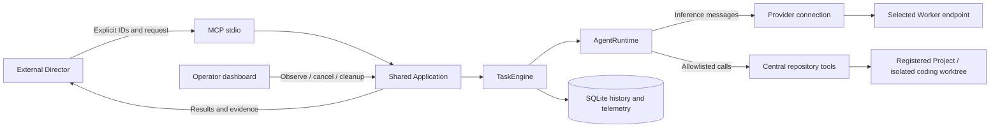
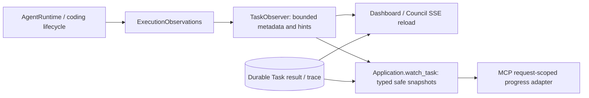

# Architecture

AgentForge executes explicitly delegated agent work. The external Director chooses
Projects, Agents and Workers, evaluates evidence and decides the next action.
AgentForge supplies bounded execution, repository tools and durable history. It
has no automatic routing, replacement, ranking or local answer synthesis.

## Responsibilities and composition

| Component | Responsibility |
| --- | --- |
| Director | Chooses the binding and request, watches/polls/cancels, evaluates results and accepts changes. |
| Application | Composes and owns one database, TaskEngine, registry, Index, tools, Councils and telemetry. |
| Operator CLI | Explicit trusted host setup/admin adapter to Registry, Index, packaged migrations, configuration parsers and Provider health. |
| Agent | Defines behavior, allowed tools, runtime limits and read-only or isolated-write workspace mode. |
| Worker | Identifies a configured inference target: protocol, connection, model and capabilities. |
| ProviderConnection | Names an operator-controlled endpoint and optional credential environment variable. |
| Provider | Implements HTTP/protocol details and normalizes tool calls, usage, timing and failures. |
| Project | Registers an existing local root with stable UUID and observed filesystem identity. |
| Task | Persists an explicit Project/Agent/Worker request and lifecycle. |
| Council | Groups independent Tasks on explicitly selected Workers, preserving all outcomes. |
| CodingWorkspaceManager | Owns creation, authorization, inspection and explicit cleanup of Task worktrees. |

Workers run inference. They receive messages and selected tool results, including
source, diffs and validation output when requested. They have no filesystem
capability or unrestricted shell. Repository execution stays on the central host;
Worker location can be local, LAN, VPN or cloud. Explicit Worker selection also
selects the data-egress destination; local repository storage does not make cloud
inference private.

`Application.from_config` loads explicit TOML files, constructs resource-free or
lazy Providers and opens no inference connection during composition. `start()`
starts one bounded TaskEngine and applies restart recovery. MCP and dashboard
lifespans use the same Application operations on its owning event loop; adapters
have no separate execution policy. Shutdown first cancels/awaits executors and
validation cleanup, then closes owned Providers and disposes the database. Cleanup
is shielded from caller cancellation. Injected Providers remain caller-owned.

Use one process per database. The ownership guard detects duplicate TaskEngines
inside a process; there is no distributed/cross-process lease. The shipped CLI
entrypoints host MCP and dashboard separately. They must not run simultaneously
against the same database. An embedding can share one Application, but no combined
server entrypoint is provided.

The installed `agentforge` CLI is separate from model tools. Administrative
commands compose only the required Registry/Index/storage/configuration services;
they never construct/start a TaskEngine or perform task recovery. Agent discovery
shares shipped definitions with Application; factory binding validation and TOML
parsing are reused. `mcp` and `web` share the existing service parsers/lifecycles
and retain one-owner semantics. No host registration capability is exposed through
MCP. Database status is read-only; registration/index/removal/upgrade are explicit,
with confirmation for deregistration. Stop executors before administrative writes.
See [operator contracts and exit codes](operator-cli.md).

## Execution and permissions

`application.definitions.shipped_agents` composes `general_agent`, `repo_explorer`
and optional `coder` in that order for Application and CLI. Application discovery
sorts by ID deterministically (with coding: `coder`, `general_agent`, `repo_explorer`);
MCP and dashboard consume Application discovery/status without separate definitions.
The Director always selects the Agent explicitly.

General Agent analyzes supplied Task context and, only when useful, project-local
documents/configuration using `list_files`, `read_file`, `search_code`, `git_status`
and `git_diff`. Repo Explorer investigates implementation with the richer cached
Python Index tools and Git-index search. No new tools or authorization path are
introduced. General Agent needs no Index refresh, but still requires a registered
Project ID and live root authorization, including supplied-context-only requests.
Project-less Tasks are deferred. Both read-only Agents are eligible for Councils;
the same Worker/tool capability validation applies without fallback.

1. Submission checks the registered Project, actual Agent and explicit Worker,
   configured Provider binding, tool definitions and known tool capability. It
   commits a queued Task without probing inference or scanning source.
2. TaskEngine claims queued work with bounded concurrency (1–32). Queued work
   surviving restart uses the current configuration under the same IDs; operators
   must preserve their meaning. Running work is never replayed after process loss.
3. For `coder`, the manager captures committed HEAD and provisions a separate
   worktree before inference. Uncommitted primary changes are not copied. The
   original Project subtree becomes the tool/validation cwd inside that worktree.
4. AgentRuntime verifies live root identity, frames the Agent prompt/request/tool
   schemas and calls the selected Provider. Tools are structured native calls;
   there is no parser that turns arbitrary assistant text into shell commands.
5. Whole-turn call IDs, permissions and counts are checked before tool I/O.
   Structured arguments and path policy are checked next. Recoverable tool errors
   return fixed codes; unsafe root/ancestry failures terminate execution.
6. The Director receives the final answer and factual evidence. Terminal outcomes
   and telemetry are persisted; coding workspaces remain for review and explicit
   cleanup. Runtime never commits, pushes, merges or creates PRs.

Default Agent limits are 12 model turns, 24 tool calls, 120 seconds total runtime,
12,000 bytes per serialized tool result, 48,000 cumulative tool-result bytes and
24,000 approximate context tokens, capped by a known Worker context window.
The context estimate is `ceil(serialized UTF-8 bytes / 3)`, including schemas and
private reasoning. It is a size heuristic, not a tokenizer guarantee. Runtime
uses non-streaming generation; direct Provider callers can use scoped streams.
Provider calls have deadlines. Synchronous tools cannot be interrupted mid-call;
their own scan/process limits apply and runtime checks cancellation/time afterward.

General Agent explicitly uses 8 model turns, 12 tool calls and 90 seconds: several-file
analysis needs less exploration than code tracing. It retains the 12,000-byte
per-result, 48,000-byte cumulative and 24,000-token context budgets for document
excerpts and synthesis. Global bounds and Repo Explorer defaults are unchanged.

Repository data and model output are untrusted. Neither can change the Project,
Worker, endpoint, tool catalog, workspace root, Git ref or validator argv. General
Agent and Repo Explorer have read-only tools. `coder` uses a separate workspace catalog with
bounded text mutation and named operator validators. Councils reject any Agent
with isolated-write capability, including custom Agent IDs.

Cancellation of queued work prevents execution. Running cancellation is durable
and cooperative; an in-flight inference call can finish or time out before it is
observed. Application shutdown cancels local async operations promptly. Closing
HTTP does not prove remote generation stopped. A committed cancellation request
wins over a late completion; a completion committed first remains terminal.

## Shared live observation

Runtime `TraceEvent` metadata flows through `ExecutionObservations` into the
executor-owned `TaskObserver`. Coding workspace provisioning and actual validation
boundaries record safe lifecycle metadata through that same path. Observation
callbacks cannot affect execution. There is no second MCP runtime/event system.

`Application.watch_task` is an async context manager yielding an async iterator of
typed `TaskProgress` snapshots. It validates identity, obtains authoritative Task
state, subscribes without an intervening await, and releases the shared bounded
subscriber on exit/cancellation. Its public contract exposes no queues or observer
internals. Reads use existing short repository transactions; none spans waiting
or notification delivery. Already-terminal Tasks need no subscriber. The dashboard
and watch use the shared `task_timeline` allowlist projection; terminal durable
result metadata supersedes ephemeral buffers. Polling and prompt submission are
unchanged.

MCP formatting belongs solely to its adapter: standard progress `message` contains
the serialized safe snapshot for the client's outstanding `watch_task` request.
No token means a prompt metadata read. Queue overflow and timeline truncation
request resync; reconnect loads current state without replay. Transport failure
only terminates observation. Future Companion consumers can use the Application
contract without depending on MCP. See [progress contract and SDK discovery](mcp.md#live-safe-task-progress).

## Persistence, privacy and security

SQLite is the supported initial persistence backend. Repositories own short
transactions; no transaction spans inference. Index refresh is transactional and
retains prior valid structure for individual parse failures. Projects/Index may
be removed without deleting historical Tasks/Councils/telemetry. Retention and
history deletion are not implemented.

Database initialization/upgrades are explicit. The packaged `0001_initial`
migration creates the first supported complete schema, including bounded operator
diagnostic checkpoints. Executor startup verifies
the revision before recovery/execution and never creates or migrates schemas.
Registrations require a recorded platform-tagged
identity, which is never replaced by observing today's path during an upgrade.
See [schema baseline and validation](development.md#migrations).

Task requests and completed final answers are intentionally persisted and can
contain sensitive content. Trace stores bounded redacted metadata, not tool bodies
or conversation history. Provider reasoning is opaque in-memory history, never
a tool authorization or intentional persisted/public field. An Agent's visible
answer and trusted validation output remain untrusted content, not a general
secret scrubber. Telemetry stores identities, safe codes, counts and timings;
unknown observations stay null. See [Tasks and telemetry](tasks.md).

Live repository access uses identity-checked POSIX descriptors or native local
NTFS handles, with fail-closed authorization. Read-only POSIX tools and coding
have different hardlink/mount guarantees; Windows rejects reparse points,
ambiguous names and multi-link files. Detailed policies and budgets are in
[repository operations](repository.md), [Windows security](windows-repository-security.md)
and [coding](coding.md). Git metadata, executable installation, operator settings,
private runtime storage and the control-plane account are trusted.

Validation is trusted host execution, **not an OS or network sandbox**. Fixed
argv, conservative environment, process groups/Windows Jobs and bounded captures
limit accidental effects and leaks. Validation programs can execute model-edited
repository code and access the host/network, including the primary checkout.
Enable them only where that execution is trusted.

MCP is trusted local stdio. The dashboard binds loopback by default and has CSRF,
Host and output-escaping protections, but no authentication layer. Do not expose
it to untrusted users. See [SECURITY.md](../SECURITY.md).

## Package boundaries and extension

| Package | Role |
| --- | --- |
| `application` | Composition, typed operations and transport projections. |
| `core`, `workers`, `providers` | Inference contracts, configuration and concrete protocol adapters. |
| `agents`, `tasks`, `councils` | Behavior, bounded execution, lifecycle and independent grouping. |
| `projects`, `index`, `tools` | Root authorization, Python structure and read-only evidence. |
| `coding` | Isolated worktrees, controlled writes, validation and cleanup. |
| `db`, `telemetry` | Persistence, packaged migrations and observation queries. |
| `mcp`, `web` | SDK stdio and server-rendered dashboard adapters. |

Transport adapters depend on Application; they do not import concrete Providers.
Runtime consumes the Provider protocol. Concrete protocol handling belongs only
in `providers`; generic runtime, TaskEngine, Council, telemetry and transports
must not branch on vendors. Provider options/raw metric dictionaries remain
intentional direct-call compatibility; runtime uses normalized usage/timing.
Inline Ollama TOML remains supported alongside named connections.

Adding a Provider requires connection validation, static factory composition,
normalization and offline tests, without a dynamic plugin framework. Custom Agents
are supplied programmatically with explicit tools and limits; no TOML Agent loader
ships. The Python Index is conservative AST navigation, not type inference,
runtime dispatch proof or an architecture summarizer. There is no general REST
API, scheduler, autonomous planning, quality benchmark/ranking engine or remote MCP server.

Specialist references: [Providers](providers.md), [MCP](mcp.md),
[dashboard](dashboard.md), [Council](councils.md), [coding](coding.md),
[Projects/Index/tools](repository.md), [Tasks/telemetry](tasks.md).

## Operator diagnostics boundary

`workers.diagnostic_service.WorkerDiagnosticsService` exposes typed configured and
observed evidence via `workers.diagnostics`, composed as Application's
`worker_diagnostics`. CLI active health/probes and passive dashboard reads share
this boundary; MCP discovery remains configuration-only. The service sends fixed
synthetic requests through the existing Provider/GenerationRequest boundary,
without Project, Agent, tools dispatcher or Task creation. TokenUsage and
GenerationTiming retain the same semantics as Task telemetry; no raw dictionaries
or request-latency throughput estimates enter observations.

A small separate SQLite checkpoint store survives CLI/dashboard process changes:
one record per Worker/probe kind, latest observation and last success/failure
timestamps, configuration invalidation and atomic completion ordering. Writes
update only the selected Worker/probe-kind checkpoint. Current configuration
controls visibility; observations for absent Workers remain dormant without an
automatic retention/pruning policy. A changed configuration fingerprint suppresses
old evidence for the same Worker. Passive reads never mutate storage, and no
transaction spans inference.
There is no accumulating probe history, metrics warehouse, routing, ranking,
background probing or active MCP control. See [Worker diagnostics](worker-diagnostics.md)
for lifecycle, security, remote egress and future Companion service contracts.

## Shared MCP and Companion lifecycle

The explicit MCP `--companion` mode adds loopback HTTP to the MCP-owned
Application, on the same event loop. `create_app(shared_application=...)` borrows
a started Application without starting, closing or disposing it. Standalone
`create_app(factory)` retains dashboard ownership. MCP lifespan closes execution
and observers before draining HTTP. HTTP does not install process signal handlers
or configure logs; stdout remains MCP protocol only. The per-database executor
guard and operator one-process requirement are unchanged.

`CompanionQueries` builds bounded typed views from Dashboard/Application contracts,
`task_progress` and coding inspection. SSE Task hints consume `watch_task`; Council
hints reuse TaskObserver multi-subscriptions. Templates have no repository/Git/SQL/
Provider access. Coding captures are stripped from the companion summary; the
bounded diff is fetched only by an explicit detail route. See [Companion](companion.md)
for the Codex capability discovery and security boundary.
