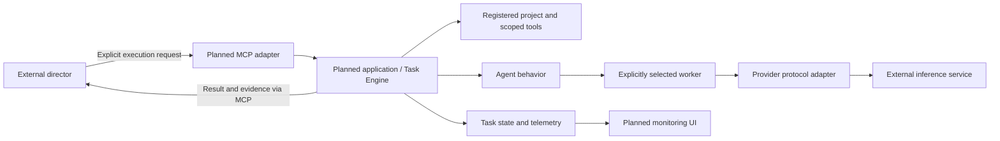
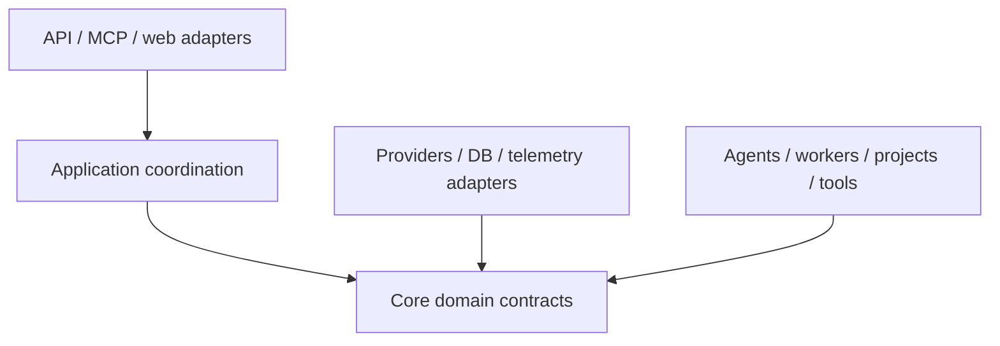

# AgentForge architecture

## Status and purpose

Phase 01 established the architectural contract and package skeleton. Phase 02
implements Provider contracts, validated Worker configuration and the Ollama HTTP
adapter, including health, generation and streaming. Phase 03 implements the
Project Registry, SQLAlchemy persistence and the initial Alembic migration.
Issue #14 adds a deterministic Python Project Index and compact repository map.
Other runtime components below remain **planned**. There are no application
endpoints, repository tools, task execution or dashboard behavior yet.

AgentForge is a generic agent execution/runtime platform. It supplies projects,
providers, workers, agents, tasks, tools, telemetry, an MCP interface and a web
monitoring UI. It is not an intelligent task router in v1.

## System boundary and director

An external strong model such as Codex/Astra/Sol/Claude is the director/orchestrator.
It chooses the project, agent and worker, supplies the request, judges whether the
result is sufficient, and decides whether another worker should be consulted.
AgentForge validates and executes explicit requests and returns results and
execution evidence. It must not silently select a different worker or judge which
model answer is best. Validation rejects invalid or unauthorized requests; it is
not a routing decision.



Inference services, registered repositories and the director sit outside the core
runtime boundary. Repository content is external data, even when stored locally.
The dashboard observes execution; it does not become the director.

## Domain contract

| Concept | Meaning | Example |
| --- | --- | --- |
| Provider | Protocol/backend used to communicate with an inference service | Ollama, llama.cpp, OpenAI-compatible HTTP |
| Worker | Concrete configured inference target: provider, endpoint, model and machine context | Ollama at a configured local endpoint, `gpt-oss:20b`, RTX 4080 |
| Agent | Behavior layered on the selected worker | `repo_explorer`, `code_reviewer`, `test_triage`, `general` |
| Project | Registered external repository/workspace with context and access boundaries | A repository identified in the Project Registry |
| Task | Durable execution request binding project, agent, worker and request | Review a change using explicit registered IDs |
| Council | Future independent executions of the same problem on explicitly selected workers | Return every worker's result to the director |

Provider handles protocol details, Worker identifies where and which model runs,
and Agent defines behavior. Agents must not embed provider endpoints or choose
workers autonomously. Multiple workers may share a provider; a provider is not a
singleton model or machine. Machine context describes the target deployment, not
a hardware scheduling subsystem.

The eventual first deployment is RTX 4080 → Ollama → `gpt-oss:20b`. It is one worker
configuration, not a core assumption. Later configurations may use Ryzen AI Max+
395 with a large local model, other local inference servers, free or paid cloud
models, or arbitrary OpenAI-compatible endpoints.

## Components and repository layout

| Package under `src/agentforge/` | Responsibility |
| --- | --- |
| `core/` | Provider/Worker inference domain contracts; future application coordination and Task Engine |
| `projects/` | Project Registry: stable project identity, repository/workspace location, context and permitted operations |
| `index/` | Deterministic Python structure, explicit refresh, graph queries and bounded textual maps |
| `providers/` | Ollama inference adapter; translate calls and failures for the backend |
| `workers/` | Validated configuration loading for concrete inference targets |
| `agents/` | Behavior definitions and eventual runtime integration with explicitly selected workers and tools |
| `tools/` | Repository operations constrained by project roots and permissions |
| `telemetry/` | Execution events, timing, errors and available usage observations |
| `db/` | SQLAlchemy persistence and Alembic migrations, using SQLite initially |
| `api/` | FastAPI transport adapter to application operations |
| `mcp/` | MCP Python SDK adapter exposing explicit operations to the director |
| `web/` | Jinja2 templates and HTMX monitoring interactions |

`tests/` holds pytest tests; `docs/` holds durable architecture documentation.
Packages other than `core/`, `providers/`, `workers/`, `projects/`, `index/` and `db/`
remain placeholders. Alembic configuration and revision scripts live in `alembic.ini`
and `migrations/` at the repository root.

### Provider and Worker foundation (Phase 02)

`core.inference.Provider` is a single structural Python protocol:

- `health(worker) -> WorkerHealth` is async and observes backend connectivity and
  configured model availability separately. It is a snapshot, not persisted state
  or a guarantee that the next generation succeeds.
- `generate(worker, request) -> GenerationResult` is async.
- `stream(worker, request)` returns an async context manager containing an async
  iterator of `GenerationChunk` values. Content is a delta, and a terminal chunk
  has `done=True` and any available final metadata.

All operations require an explicitly supplied Worker. There is no provider
registry, worker selection, routing or fallback. Future callers can accept the
protocol without importing the concrete Ollama adapter.

`core.worker.Worker` is a validated configuration model containing ID, provider
name, model, HTTP(S) endpoint, optional context window and deployment label,
configured streaming/tool-use capabilities, timeout and provider options. Unknown
tool-use support is `None`; streaming defaults to disabled until configured.
Advertising tool support does not implement tool calls or execution in this phase.
Endpoints cannot embed credentials, queries or fragments. `WorkerHealth.available`
requires both backend connectivity and observed model availability.

`GenerationRequest` contains conversational messages, an optional prepended system
instruction, optional temperature, provider options and optional timeout override.
The text-only contract does not normalize tools, multimodal input or reasoning
channels. Results contain content, model identity, optional finish reason and
optional provider-specific usage/timing dictionaries. Ollama token counts retain
their API names, and duration values retain their API names and nanosecond units;
missing observations remain absent rather than estimated.

`providers.ollama.OllamaProvider` uses httpx with `/api/chat` for generation and
newline-delimited JSON streaming, and `/api/tags` for health/model presence checks.
Each operation owns and closes its HTTP client; streaming also owns the response
and iterator. Incomplete or malformed responses raise `InvalidProviderResponse`;
connectivity failures raise `BackendUnavailable`, timeouts raise `ProviderTimeout`,
and HTTP/model rejections raise `ProviderRejected` with an optional HTTP status.
Error messages omit backend bodies, endpoint secrets and input payloads. Health
reports safe error codes instead of raising backend failures; invalid adapter/Worker
pairings are rejected before HTTP work.

Callers must consume streams inside `async with`. Exiting the block closes the
HTTP request on completion, early break, caller error or cancellation. Cancelling
the executing asyncio task propagates `CancelledError` and closes local resources.
Ollama offers no task-ID cancellation primitive here: closing the request does not
guarantee that remote generation has stopped. No Task Engine is implemented.

The Worker timeout defaults to 120 seconds; request overrides apply to generation
and streaming. It is a total wall-clock execution budget as well as an HTTP I/O
timeout, with connection attempts capped at 10 seconds. For streaming, this budget
includes caller processing within the context block. Health is bounded by the
smaller of five seconds and the Worker timeout.

`workers.config.load_workers(path)` reads one explicitly supplied TOML file into
`WorkersConfig`, validating each Worker and rejecting duplicate IDs/unknown fields.
Multiple Workers can share one provider implementation. There is no automatic
config discovery, environment loader, plugin framework or application wiring.
`config/workers.example.toml` defines the illustrative `local-4080` target; it is
not loaded by default. Worker options are merged with request options, then a known
Worker context window sets Ollama `num_ctx`, and explicit request temperature takes
precedence. The model and endpoint always come from the supplied Worker. Secrets
belong in local secret configuration; authentication integration is deferred.

Tests use httpx mock transports and fake byte streams. A suite-wide guard rejects
live network connections and DNS resolution, so no GPU, Ollama or Internet is
needed to run them.

### Project Registry and persistence (Phase 03)

`projects.models.Project` is immutable configuration: a generated UUID, a
human-readable name, a canonical absolute local root and a UTC creation timestamp.
Names may repeat; canonical roots may not. Identity does not depend on a mutable
name or path. A normal directory is a valid project; Git is optional. Core contains
no project-specific assumptions.

`projects.service.ProjectRegistry` exposes synchronous, transport-independent
`register_project(name, root_path)`, `list_projects()`, `get_project(id)`,
`remove_project(id)` and `inspect_project(id)`. IDs accept UUIDs or UUID strings.
Removal deletes registration and its cached index, never repository files.
Configuration remains retrievable/removable when its directory is unavailable;
inspection validates that the root still exists.
Important failures have explicit `ProjectError` subclasses, including invalid
paths/names, duplicate roots, missing IDs, unsafe candidates and storage failures.
SQLAlchemy errors and database statements are not exposed as service errors.

Relative registration paths use the registry's explicit `base_directory`, or the
working directory captured at construction. Registration follows symlinks and
requires an existing directory, so aliases of the same directory collide. The
stored canonical root is the security boundary. `resolve_path(id, candidate)`
and `projects.paths.resolve_project_path(root, candidate)` resolve existing
candidates and check `Path.is_relative_to` against the resolved root. Absolute
paths, `..`, common-prefix siblings and symlinks receive the same containment
check. A stored root replaced by a symlink to another location is rejected.
Validation is a point-in-time check: future file tools must address filesystem
races between validation and I/O, and separately define safe creation semantics
for nonexistent paths. No repository file tools exist yet.

`inspect_project` returns `ProjectInspection(project, git)`. `GitMetadata` is a
fresh, nonpersisted observation with an observation timestamp, discovery status,
repository/worktree root, optional branch and optional HEAD commit. Status is
`repository`, `not_repository` or `unavailable`; unavailable discovery does not
assert that the directory is non-Git. Detached HEAD has no branch; an unborn
repository has no commit. Git failures/timeouts are best effort and do not prevent
registration. Inspection uses bounded, read-only `rev-parse`/`symbolic-ref` calls
with an explicit working directory, sanitized Git environment, disabled optional
locks and no network or repository mutation. Separate reads are not an atomic
snapshot of a concurrently changing repository. An observed Git root may be an
ancestor of a registered subdirectory; it never expands the approved boundary.

`db.database` owns explicit SQLAlchemy 2 engine/session construction;
`db.models.ProjectRecord` owns the `projects` table. `db.projects.ProjectRepository`
maps records to domain values and owns short-lived sessions/transactions, a unique
canonical-root constraint and error translation. The service currently uses this
small concrete storage adapter; domain models, path helpers and Git inspection
have no SQLAlchemy dependency. No generic repository framework is introduced.
SQLite is the initial backend; UUID and timezone-aware timestamp columns use
SQLAlchemy types. SQLite timestamps are interpreted as UTC when read.

Schema changes are explicit Alembic operations, never registration/startup side
effects. From the repository root in the development venv:

```sh
alembic upgrade head
alembic revision --autogenerate -m "Describe the schema change"
alembic check
```

`alembic.ini` defaults to the ignored local `agentforge.db`; set `sqlalchemy.url`
in a local Alembic configuration for another database. Pass the same URL to
`create_database_engine`, then wire `create_session_factory(engine)` →
`ProjectRepository` → `ProjectRegistry`. Dispose the engine when its owner shuts
down. The initial revision creates only project configuration. Tests migrate
temporary SQLite databases and verify upgrade/downgrade and database reopening.

Project-specific configuration stays with registry entries, separate from generic
runtime behavior. Repository read tools and architecture summaries remain deferred.

### Deterministic Project Index (Issue #14)

`index.service.ProjectIndex` consumes the existing `ProjectRegistry` and
`db.index.IndexRepository`. Wire both repositories with a session factory for the
same migrated database. The service is synchronous and transport-independent:
`refresh_index(id)`, `get_index_status(id)`, `find_symbol(id, query)`,
`get_symbol(id, symbol_id)`, `get_dependencies`, `get_dependents`,
`get_related_symbols`, `get_relationships` and
`render_project_map(id, focus=None, max_tokens=3000)`. No HTTP/MCP adapter, source
content tool, agent runtime, or worker is involved.

The boundary is Python bytes → built-in AST → small immutable extraction records
→ SQLite → queries/maps. `index.python_parser` owns definitions, line locations,
lexical containment and import/call facts; it never executes source. Its
`parse_python(relative_path, bytes) -> ParsedFile` boundary allows another parser
later without a plugin framework or storage redesign. `index.scanner` owns safe
file reads/exclusions. `db.index` owns transaction-scoped replacement and link
resolution; `index.render` owns deterministic relevance and bounded rendering.
No LLM, embeddings, vector database or graph library builds structural facts.

Alembic revision `0002_project_index` follows the shipped `0001_projects` revision.
Four small tables store project snapshot metadata, eligible files, symbols and
relationships. Files carry observed and last successfully parsed SHA-256 hashes;
raw source/bodies are not persisted. Module symbols act as containment roots and
import targets; only unambiguous, unshadowed module-level definitions are eligible
definition import targets. Definition IDs hash the relative path, kind, lexical
qualified name and start line, so duplicate and nested definitions stay distinct.
IDs can change when definitions move. IDs are scoped to a Project, with no
cross-project semantic identity. Module names follow paths relative to the
registered root, with package `__init__.py` mapped to its directory. A root
initializer uses the display namespace `__root__`, without assuming an absolute
package name; its relative imports of indexed child modules can still link.
The index does not infer Python installation layouts, `sys.path` or `src/` roots.

Refresh explicitly scans `.py` files one at a time, compares content hashes and
reuses unchanged extraction records. New/changed files replace their structure;
deleted files are removed. Import links are recomputed from cached facts against
the complete current symbol set, including unchanged importers. A fresh registry
Git observation records HEAD when available, but never determines freshness:
dirty working trees and non-Git projects use the same hash checks.
`get_index_status` performs an explicit live hash scan and reports changed paths,
counts, snapshot time, observed HEAD and parse failures. Other queries read cached
structure; callers check status or request refresh when they need current data.

One database transaction covers the complete refresh. Filesystem, unexpected
parser or storage failures roll back all changes. Invalid Python syntax/encoding
is a per-file failure: its observed hash and a safe diagnostic are stored, while
its previous valid symbols/relationships remain available, flagged `stale` and
marked in maps. A newly invalid file has no structural records. Unchanged invalid
files retain their diagnostic without reparsing; edits retry parsing. Status keeps
reporting these failures, so a partial index is never presented as fully current.
SQLite connections enable foreign keys and transaction control covering reads;
cascades clean file-owned facts and all index tables when the registry removes a
Project. Resolved target IDs are checked and rebuilt transactionally rather than
defining a generic graph ORM.

The registry's stored canonical root and `validate_registered_root` remain
authoritative. Traversal skips **all** symlinks (including internal aliases), special
files and fixed cache/build/vendor/IDE/secret directories, including `.git`, virtual
environments, `site-packages`, `node_modules`, `dist`, `build`, `vendor`,
`third_party` and `.secrets`; no configurable ignore engine is added. POSIX
no-follow descriptors anchor root ancestors, directory traversal and regular-file
reads, closing the validation/I/O symlink race. Unsupported descriptor capabilities
fail closed.
Root/directory replacement and changes during a file read abort refresh. The
repository is strictly read-only, and index operations never access the network.
As with Git inspection, a changing filesystem is not an atomic source snapshot;
explicit hash checks/refresh detect subsequent edits.

Relationships retain their kinds and direction: `contains`, `imports`, `calls`.
Dependencies are outgoing resolved edges, dependents incoming resolved edges, and
related symbols return their union as typed edges. `get_relationships` also exposes
unresolved textual imports/simple calls with a null target. Imports link only
unambiguous root-relative indexed modules/definitions; external imports, wildcards,
unknown exports and ambiguous names are not guessed. Call links describe syntactic
lexical targets, not guaranteed runtime dispatch: unique plain local definitions
and straightforward `self.method()` within a plain class without bases, metaclass,
class decorators or custom attribute lookup. Parameters, assignments,
imports, duplicate/conditional/decorated definitions and explicit receiver/method
rebinding block uncertain links. Arbitrary `obj.method()`, inherited dispatch,
imported-alias calls, lambdas/comprehensions, dynamic exports, monkeypatching and
full type inference are deliberately unsupported. No general reference analysis
or graph path operation is implemented. `find_symbol` returns all case-insensitive
exact simple/qualified matches, falling back to qualified-name substrings; it never
selects one ambiguous definition silently.

Maps contain paths, classes/functions/methods and start lines, without bodies or
AI summaries. Focus ranks exact names, qualified names, substrings/path matches
and direct import/call neighbors. General maps use relationship degree, top-level
definition counts and shallow paths before stable lexical tie-breaks. Rendering
uses whole structural lines, with necessary parent context, and a strict UTF-8
byte cap of `3 * max_tokens`; `ceil(bytes / 3)` is the documented approximate token
estimator, not a model-tokenizer guarantee. Zero or too-small budgets return an
empty map; negative/noninteger budgets are rejected. Future repository tools and
local agents may request exact source regions from these paths/line spans. Future
architecture summaries may consume these deterministic facts, but summaries,
visualizations, routing and execution remain separate, unimplemented capabilities.

### Tasks and repository tools

The future Task Engine will validate explicit bindings, persist execution requests
and lifecycle state, coordinate execution, and make outcomes retrievable. Detailed
states, cancellation, retries and concurrency policy belong to their implementation
issues. Infrastructure errors must be reported to the director; automatic model
fallback would violate explicit worker selection.

Repository tools will provide scoped operations useful for exploration, review and
test triage. Initial permissions should favor read-only access; execution and write
operations require explicit authorization and separately implemented controls.
No repository tools or write-capable agents exist in this phase.

### Telemetry, MCP and dashboard

Telemetry will record task identity, selected project/agent/worker, execution
events, timings and failures, with usage data only where providers expose it.
Do not assume all providers expose identical token or cost information. Retention,
storage schema and event delivery are future decisions.

MCP is the director-facing boundary. Future tools will accept explicit identifiers
and requests and return task results/status and relevant evidence. The MCP adapter
must reuse application behavior rather than implement its own task runtime.
No MCP tool names, server transport or authentication mechanism is fixed here.

The dashboard will monitor projects, workers, tasks and telemetry using Jinja2
and HTMX. It consumes shared application operations rather than accessing inference
services directly. HTMX is a future browser asset, not a Python dependency;
asset delivery is deferred. No React/Node stack or dashboard behavior is included.

### Council

Council is a future application operation: the director explicitly selects several
workers, each executes the same problem independently, and all results are returned
with worker identity and execution evidence. AgentForge does not rank answers,
seek consensus or choose a winner. No Council implementation is part of Phase 01.

## Dependency direction and extension points

The intended source dependency direction is inward toward project-agnostic domain
and application contracts:



Core domain contracts must not import API, MCP, web or concrete inference adapters.
Application coordination uses capabilities defined by actual use cases; outer
adapters supply implementations when wiring is introduced. Runtime calls can go
outward to an adapter without reversing source dependencies. Avoid speculative
interfaces before a feature needs them, and avoid circular imports between areas.

Extension points are additional provider adapters, worker configurations, agent
behaviors and permission-scoped tools. New projects are registry entries, not core
code changes. Design these seams incrementally with tests when their behavior is
known; a plugin loader or generalized dependency injection framework is not needed
for the bootstrap.

The chosen stack is Python 3.12+, FastAPI, Pydantic v2, SQLAlchemy 2, Alembic,
SQLite initially, MCP Python SDK, httpx, Jinja2, HTMX, pytest and ruff. Dependencies
are declared now, but adopting a library does not imply its runtime is implemented.

## Security principles for future implementation

- Enforce project-root containment, including resolved paths and symlinks; do not
  allow repository content or model output to expand permissions.
- Separate untrusted instructions/data from director authorization. Agent behavior
  and tool policy must not treat prompt injection as permission to act.
- Validate project, agent and worker identifiers and tool permissions before work.
  Restrict configured inference endpoints to administrator-approved destinations.
- Keep credentials in local environment/secret configuration, never repository
  source or project content. Redact secrets from errors, task output and telemetry.
- Apply least privilege to files, commands and network access. Add isolation,
  timeouts and resource limits alongside the features that need them.
- Protect API/MCP/dashboard access before remote exposure. Transport and
  authentication decisions are deferred, not implicitly solved by localhost.
- Treat local databases and runtime logs as private runtime state. Define retention
  and output limits when persistence and telemetry are implemented.

These principles are contracts for later work, not existing security controls.

## Future execution flow

1. The director discovers registered projects, agents and workers through the
   future interface and chooses explicit identifiers.
2. It submits a request binding project, agent and worker, with permitted tool scope.
3. Application coordination validates the bindings and authorization and persists
   a durable task before execution.
4. The agent executes its behavior using the selected worker's provider and approved
   project tools; state and telemetry capture execution progress and errors.
5. AgentForge returns or exposes the task result, selected identities and evidence.
   The dashboard monitors the same task state through shared application behavior.
6. The director evaluates sufficiency and may explicitly request another execution
   or a future Council run. AgentForge does not make that decision itself.
