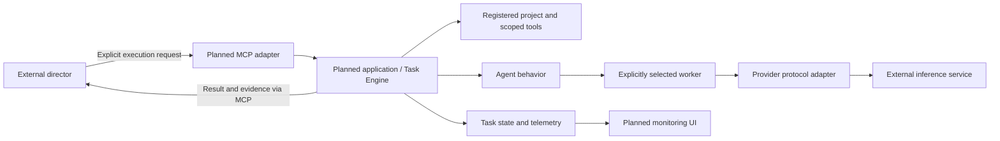
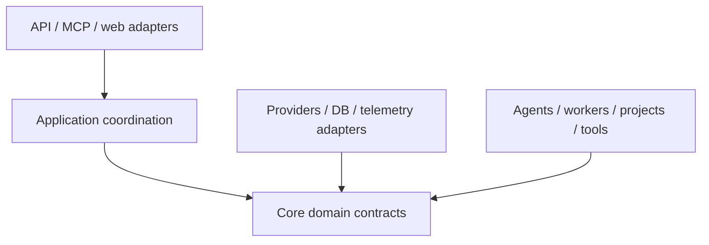

# AgentForge architecture

## Status and purpose

Phase 01 establishes this architectural contract, repository rules, dependency
configuration and importable package placeholders. All runtime components below
are **planned**, not implemented. There are no endpoints, database models,
migrations, inference calls, tools, task execution or dashboard behavior yet.

AgentForge is a generic agent execution/runtime platform. It supplies projects,
providers, workers, agents, tasks, tools, telemetry, an MCP interface and a web
monitoring UI. It is not an intelligent task router in v1.

## System boundary and director

An external strong model such as Codex/Astra/Sol/Claude is the director/orchestrator.
It chooses the project, agent and worker, supplies the request, judges whether the
result is sufficient, and decides whether another worker should be consulted.
AgentForge validates and executes explicit requests and returns results and
execution evidence. It must not silently select a different worker or judge which
model answer is best. Validation rejects invalid or unauthorized requests; it is
not a routing decision.

Inference services, registered repositories and the director sit outside the core
runtime boundary. Repository content is external data, even when stored locally.
The dashboard observes execution; it does not become the director.

## Domain contract

| Concept | Meaning | Example |
| --- | --- | --- |
| Provider | Protocol/backend used to communicate with an inference service | Ollama, llama.cpp, OpenAI-compatible HTTP |
| Worker | Concrete configured inference target: provider, endpoint, model and machine context | Ollama at a configured local endpoint, `gpt-oss:20b`, RTX 4080 |
| Agent | Behavior layered on the selected worker | `repo_explorer`, `code_reviewer`, `test_triage`, `general` |
| Project | Registered external repository/workspace with context and access boundaries | A repository identified in the Project Registry |
| Task | Durable execution request binding project, agent, worker and request | Review a change using explicit registered IDs |
| Council | Future independent executions of the same problem on explicitly selected workers | Return every worker's result to the director |

Provider handles protocol details, Worker identifies where and which model runs,
and Agent defines behavior. Agents must not embed provider endpoints or choose
workers autonomously. Multiple workers may share a provider; a provider is not a
singleton model or machine. Machine context describes the target deployment, not
a hardware scheduling subsystem.

The eventual first deployment is RTX 4080 → Ollama → `gpt-oss:20b`. It is one worker
configuration, not a core assumption. Later configurations may use Ryzen AI Max+
395 with a large local model, other local inference servers, free or paid cloud
models, or arbitrary OpenAI-compatible endpoints.

## Planned components and repository layout

| Package under `src/agentforge/` | Responsibility when implemented |
| --- | --- |
| `core/` | Project-agnostic domain contracts and application coordination, including the future Task Engine |
| `projects/` | Project Registry: stable project identity, repository/workspace location, context and permitted operations |
| `providers/` | Inference protocol adapters; translate calls and failures for each backend |
| `workers/` | Concrete inference target configuration and lookup |
| `agents/` | Behavior definitions and eventual runtime integration with explicitly selected workers and tools |
| `tools/` | Repository operations constrained by project roots and permissions |
| `telemetry/` | Execution events, timing, errors and available usage observations |
| `db/` | SQLAlchemy persistence and Alembic migrations, using SQLite initially |
| `api/` | FastAPI transport adapter to application operations |
| `mcp/` | MCP Python SDK adapter exposing explicit operations to the director |
| `web/` | Jinja2 templates and HTMX monitoring interactions |

`tests/` holds pytest tests; `docs/` holds durable architecture documentation.
Placeholders contain only package docstrings. This phase does not define base
classes, abstract interfaces, service wiring or data models.

### Registry, tasks and repository tools

The Project Registry will map registered project IDs to approved external roots
and project context. Core must contain no SlopeForge-specific or other
project-specific rules. Tool access uses registry boundaries rather than trusting
arbitrary paths supplied by a prompt. Project-specific configuration stays with
the registered project, separate from generic runtime behavior.

The future Task Engine will validate explicit bindings, persist execution requests
and lifecycle state, coordinate execution, and make outcomes retrievable. Detailed
states, cancellation, retries and concurrency policy belong to their implementation
issues. Infrastructure errors must be reported to the director; automatic model
fallback would violate explicit worker selection.

Repository tools will provide scoped operations useful for exploration, review and
test triage. Initial permissions should favor read-only access; execution and write
operations require explicit authorization and separately implemented controls.
No repository tools or write-capable agents exist in this phase.

### Telemetry, MCP and dashboard

Telemetry will record task identity, selected project/agent/worker, execution
events, timings and failures, with usage data only where providers expose it.
Do not assume all providers expose identical token or cost information. Retention,
storage schema and event delivery are future decisions.

MCP is the director-facing boundary. Future tools will accept explicit identifiers
and requests and return task results/status and relevant evidence. The MCP adapter
must reuse application behavior rather than implement its own task runtime.
No MCP tool names, server transport or authentication mechanism is fixed here.

The dashboard will monitor projects, workers, tasks and telemetry using Jinja2
and HTMX. It consumes shared application operations rather than accessing inference
services directly. HTMX is a future browser asset, not a Python dependency;
asset delivery is deferred. No React/Node stack or dashboard behavior is included.

### Council

Council is a future application operation: the director explicitly selects several
workers, each executes the same problem independently, and all results are returned
with worker identity and execution evidence. AgentForge does not rank answers,
seek consensus or choose a winner. No Council implementation is part of Phase 01.

## Dependency direction and extension points

The intended source dependency direction is inward toward project-agnostic domain
and application contracts:

Core domain contracts must not import API, MCP, web or concrete inference adapters.
Application coordination uses capabilities defined by actual use cases; outer
adapters supply implementations when wiring is introduced. Runtime calls can go
outward to an adapter without reversing source dependencies. Avoid speculative
interfaces before a feature needs them, and avoid circular imports between areas.

Extension points are additional provider adapters, worker configurations, agent
behaviors and permission-scoped tools. New projects are registry entries, not core
code changes. Design these seams incrementally with tests when their behavior is
known; a plugin loader or generalized dependency injection framework is not needed
for the bootstrap.

The chosen stack is Python 3.12+, FastAPI, Pydantic v2, SQLAlchemy 2, Alembic,
SQLite initially, MCP Python SDK, httpx, Jinja2, HTMX, pytest and ruff. Dependencies
are declared now, but adopting a library does not imply its runtime is implemented.

## Security principles for future implementation

- Enforce project-root containment, including resolved paths and symlinks; do not
  allow repository content or model output to expand permissions.
- Separate untrusted instructions/data from director authorization. Agent behavior
  and tool policy must not treat prompt injection as permission to act.
- Validate project, agent and worker identifiers and tool permissions before work.
  Restrict configured inference endpoints to administrator-approved destinations.
- Keep credentials in local environment/secret configuration, never repository
  source or project content. Redact secrets from errors, task output and telemetry.
- Apply least privilege to files, commands and network access. Add isolation,
  timeouts and resource limits alongside the features that need them.
- Protect API/MCP/dashboard access before remote exposure. Transport and
  authentication decisions are deferred, not implicitly solved by localhost.
- Treat local databases and runtime logs as private runtime state. Define retention
  and output limits when persistence and telemetry are implemented.

These principles are contracts for later work, not existing security controls.

## Future execution flow

1. The director discovers registered projects, agents and workers through the
   future interface and chooses explicit identifiers.
2. It submits a request binding project, agent and worker, with permitted tool scope.
3. Application coordination validates the bindings and authorization and persists
   a durable task before execution.
4. The agent executes its behavior using the selected worker's provider and approved
   project tools; state and telemetry capture execution progress and errors.
5. AgentForge returns or exposes the task result, selected identities and evidence.
   The dashboard monitors the same task state through shared application behavior.
6. The director evaluates sufficiency and may explicitly request another execution
   or a future Council run. AgentForge does not make that decision itself.
