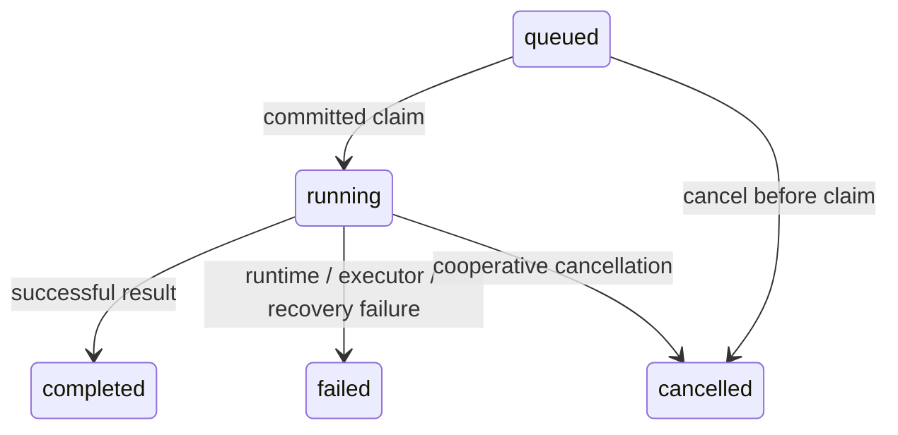

# Tasks, runtime and telemetry

`tasks.engine.TaskEngine(TaskRepository, AgentRuntime, concurrency=1)` is the
transport-independent entry point for normal delegated Agent execution. The manual
smoke script uses it. Direct `AgentRuntime.run()` remains the bounded mechanism
and a useful isolated runtime test boundary, rather than application scheduling.
The director chooses the Project, Agent and Worker. Task Engine persists and
executes those exact logical IDs; AgentRuntime performs bounded execution; the
Worker performs inference; AgentForge tools access Project files centrally.

`tasks.models.Task` is an immutable snapshot. The `tasks` table stores:

| Fields | Stored meaning |
| --- | --- |
| `task_id` | Generated stable UUID; each submit is a new execution request |
| `project_id`, `agent_id`, `worker_id` | Immutable, explicit logical binding |
| `request` | Original unmodified request text |
| `state` | queued, running, completed, failed or cancelled |
| `created_at`, `updated_at`, `started_at`, `finished_at` | UTC lifecycle checkpoints; unobserved timestamps remain null |
| `cancellation_requested_at` | Durable cooperative cancellation request |
| `reason`, `error_code` | Runtime termination reason or fixed safe engine diagnostic; error code only on failure |
| `execution_result` | Nullable JSON representation of the existing `ExecutionResult`, including ordered trace and observed usage |

`Task.final_answer` exposes the result's answer only for completed Tasks;
`failure_diagnostic` derives text from the fixed error code. Summary counts
(`steps`, `tool_call_count`, `tool_output_bytes`) and one optional `TokenUsage` per
successful model turn remain inside `execution_result`. Unknown usage remains
unknown. There is no second runtime outcome schema or fabricated aggregate.
Project identity deliberately has no cascading foreign key: deregistration
removes configuration/index, but retains Task history. A queued Task whose Project
was removed fails runtime configuration validation; it never changes Project.

The service provides synchronous operations on its owning thread (and owning event
loop while executing):

- `submit(project_id=..., agent_id=..., worker_id=..., task=...) -> Task` commits a
  queued Task before any runtime work. All bindings are required. Shared
  `AgentRuntime.validate_binding()` checks Project registration, Agent/Worker IDs,
  matching configured Provider, tool definitions/permissions and known tool-use
  incompatibility. It does not probe health or access live Project files.
- `get_task(task_id) -> Task` reads durable state, including after database reopen.
- `list_tasks(state=None, project_id=None, agent_id=None, worker_id=None,
  limit=100, offset=0)` combines optional filters. Limit is 1–1000, offset is
  nonnegative; ordering is descending creation timestamp, then descending UUID.
  Pagination is deterministic for an unchanged history, not a snapshot across
  concurrent submissions.
- `cancel_task(task_id) -> Task` returns the durable snapshot after the request.
  Missing/invalid IDs raise safe `TaskNotFound`; terminal cancellation is an
  idempotent read and does not change timestamps or outcome.

Configuration checks repeat at execution time, and live Project root authorization
remains in AgentRuntime/tools. An unavailable or replaced root can therefore fail
after a valid submit. Remote inference availability can also change; an unavailable
Worker fails the Task associated with that Worker, with no selection or fallback.
Definitions/configurations are supplied by the host when wiring the runtime;
queued Tasks store logical IDs, not snapshots of endpoints or Agent definitions.
Administrators must preserve the meaning of those IDs across restarts.

Transitions are centralized in `validate_transition()` and enforced by conditional
database updates. There is no public operation for arbitrary state mutation:

Completed, failed and cancelled Tasks are terminal and cannot be requeued or
claimed. Repeated submit intentionally creates distinct UUIDs; there is no request
deduplication/idempotency key. Duplicate claim/finish calls cannot replay or replace
terminal executions. A conditional queued-to-running update commits before invoking
the runtime, so two claim attempts can produce only one winner.

`await start()` first resolves orphaned running Tasks, then starts exactly the
configured number of long-lived asyncio executor loops (1–32, default 1). Each
loop claims the oldest queued Task with UUID tie-breaking and runs it to completion
before claiming another. Async events wake idle loops; there is no per-submission
asyncio task, broker or external scheduler. Concurrent inference can complete out
of order. Use `async with TaskEngine(...)` to own startup/shutdown;
`await wait_task(id)` waits for a terminal snapshot without owning execution.
Cancelling that waiter does not cancel the Task. A process-local ownership guard
rejects a second active engine for the same SQLite database before recovery;
deployments must run only one control-plane process per database. There are no
cross-process leases or exactly-once distributed guarantees.

Queued cancellation commits `cancelled` before execution and prevents claiming.
Running cancellation commits `cancellation_requested_at` and signals the active
`CancellationToken`. State stays running until runtime returns and local
cleanup completes. Tokens are registered without an await between claim and
registration, so cancellation cannot miss that boundary on the owning loop.
The runtime checks cancellation at model/tool boundaries. An awaited remote call
may continue until return/timeout; synchronous tools cannot be interrupted mid-call.
No remote force-kill is claimed.

The first committed database operation decides completion/cancellation races.
A cancellation request committed while running wins over any later runtime
outcome: Task/result become cancelled and a late answer is discarded. If the
runtime had already returned another reason, its trace metadata is retained and
an explicit cancelled termination event is appended. A terminal commit that wins
first is unchanged by a later cancellation. Repeated pending cancellations retain
the original request timestamp.

`await close()` stops claims, signals active tokens, cancels local executor
coroutines and awaits Provider cleanup. Active Tasks without an explicit cancel
request fail with `executor_cancelled`; explicit pending cancellation wins as above.
Queued Tasks remain queued. Cleanup is shielded from cancellation of the close
caller; ownership remains held until cleanup finishes. Storage/executor failures
surface through safe service errors, rather than silently presenting success.
If storage itself is unavailable, a terminal checkpoint may not be writable;
the next successful startup applies recovery.

Startup first requires the current packaged schema revision, without migration or
history changes on rejection. It then marks every pre-existing running Task failed with
`execution_interrupted`, including unobserved cancellation requests, without
re-executing it. A started run/tool call may already have produced effects and is
not replay-safe. Queued Tasks resume in deterministic claim order: they have never
passed the committed claim boundary and no runtime work has started. Terminal
history is unchanged. These guarantees assume callers use Task Engine and the
single-process deployment contract; they do not imply exactly-once remote inference.

`db.tasks.TaskRepository` owns operation-scoped sessions and short transactions for
submission, claim, cancellation, result storage and recovery. No database session
or transaction spans inference, remote HTTP, repository tools or the whole runtime.
Schema creation/upgrade is explicit via Alembic, never startup. Downgrading to
`base` destroys history; see [schema baseline and validation](development.md#migrations).

Only sanitized ExecutionResult fields are serialized. Task Engine verifies result
binding/state and discards invalid outcomes with `invalid_runtime_result`;
unexpected runtime exceptions become `runtime_error` without messages/repr.
Runtime failure codes and metadata are preserved, with no raw backend responses,
credentials, SQL, tracebacks, Git diagnostics or source/tool bodies added to trace.
Opaque reasoning/thinking and conversation history remain memory-only. Original
requests and normal final answers are intentionally persisted user/model content;
the database is private runtime state, not a general-purpose content scrubber.
Trace/result storage occurs at terminal checkpoints, not incrementally: after a
crash, partial in-memory trace and counts are unavailable and are not invented.
Retention/deletion policy is not implemented. Dashboard observation is ephemeral;
terminal telemetry uses the boundaries described below.

Topology does not affect Task Engine behavior. `local-4080`, `home-i5`, `ai395` and
`cloud-worker` are equivalent logical bindings. The central AgentForge host
owns SQLite, Projects, Index and tools (including on the user's main Windows
workstation); a Worker endpoint can be local, LAN, VPN/Tailscale or cloud HTTP(S).
Workers receive inference messages and explicitly gathered tool evidence, never
require Project filesystem access, and receive no copied repository/shared mount.
Repository authorization uses the explicitly selected platform backend; unsupported
capabilities fail closed without giving Workers filesystem access.

## Terminal telemetry

Telemetry **observes and never routes Tasks**. Every binding still comes from the
external director. Local `local-4080`, network `home-i5`, `ai395` and cloud
Workers use the same metadata path. No health probes, endpoint assumptions, shared
Project filesystem, hardware estimates, ranking, fallback or selection policy is
introduced. A selected unreachable Worker fails under its own identity.

Tasks store configured `provider`/`model`, a nullable monotonic queue duration and
`telemetry_status`, plus one `task_telemetry` row per successfully recorded terminal
Task execution. Telemetry has no JSON blobs, per-turn child tables or cascading foreign
keys. Historical identifiers and observations survive Project deregistration,
Worker edits and even Task deletion. Identity/time indexes support dashboard
filters. Retention/deletion policy is not implemented. Live metadata notifications are
independent of terminal telemetry persistence.

Normal `TaskEngine.submit` snapshots the selected Worker's configured provider and
model. Claim refreshes that snapshot from the runtime which will execute the Task:
queued work surviving a restart can use changed configuration under the same
explicit Worker ID. Once running, this execution identity is immutable. A missing
Worker at claim has unknown provider/model; the ID is still retained. Queued
cancellation records the submitted target, with no inference attempted. The model
is the **configured execution target**, not arbitrary text from the backend's model
label. No endpoint, credentials or Worker options are stored in telemetry.

`AgentRuntime` records a bounded `ModelTurnObservation` for each attempted
non-streaming `generate()`, including errors and local asyncio cancellation. Only
normalized `TokenUsage`, `GenerationTiming` and client request duration are retained.
Successful `ExecutionResult` metadata includes these observations; the executor
also holds an ephemeral `ExecutionObservations` checkpoint for shutdown, when the
runtime propagates cancellation instead of returning a result. Existing sanitized
`TraceEvent` tool duration evidence supplies tool aggregates; tools are not timed
again. Neither another execution loop nor a second trace store is introduced.

Terminal transitions, queued cancellation and startup orphan recovery automatically
record telemetry within the existing short Task transaction. No DB session remains
open during inference. The terminal Task write precedes a telemetry savepoint. A
telemetry construction/insert failure rolls back that savepoint, retains the Task
outcome/result and commits `telemetry_status="unavailable"`. Successful recording
commits `"recorded"`; pending Tasks use `"pending"`. A complete Task transaction or
commit failure retains existing `TaskStorageError` behavior; storage outages cannot
guarantee any persistence. Duplicate finishes/cancels never replace terminal facts.
No raw persistence exceptions are exposed or logged by this path.

Unknown configured targets or elapsed observations remain null. Startup marks running
orphans `execution_interrupted`, records their previously persisted identity and
queue duration, and leaves lost counters and execution timings unknown. Work is
never replayed automatically.

All elapsed fields are **seconds**; persisted lifecycle timestamps use UTC wall
clock. Runtime and engine elapsed measurements use monotonic clocks, independent
of wall-clock adjustments. Definitions for every persisted telemetry column:

| Columns | Exact meaning |
| --- | --- |
| `task_id`, `project_id`, `agent_id`, `worker_id` | Durable explicitly selected execution identity; no mutable configuration joins needed. |
| `provider`, `model` | Configured execution target captured as above; null when unknown. |
| `state`, `reason`, `error_category` | Terminal Task state, safe termination code, and Task failure code (null for completed/cancelled outcomes). |
| `created_at`, `started_at`, `finished_at` | UTC Task lifecycle checkpoints; queued cancellation has no start. Recovery finish is when interruption is discovered, not a guessed process-death time. |
| `queue_duration_seconds` | Monotonic interval from submission immediately before its DB insert to immediately before claim, or queued cancellation. Available only to the submitting engine while it retains that clock origin. Restart/resumed queues or direct repository claims leave this null; no wall-clock subtraction substitutes for it. Includes submission persistence overhead, excludes claim persistence overhead. |
| `execution_duration_seconds` | Engine monotonic interval from successful claim return to the terminal checkpoint invocation, including runtime validation, model calls, tool work and cancellation cleanup. Excludes queue and terminal persistence. Zero for queued cancellation; null after process loss. |
| `total_duration_seconds` | Sum of known queue and execution durations. Null if either is unknown. Claim and terminal DB overhead are excluded; this is not a wall-clock lifecycle subtraction. |
| `model_call_count` | Number of attempted `generate()` calls from runtime request evidence, including failed/cancelled attempts. A step failing before request construction completes does not count as a call. Zero when no call occurred; null when process loss destroyed evidence. |
| `model_request_duration_seconds` | Sum of monotonic client durations bracketing `generate()` awaits, including failure/cancellation cleanup and transport overhead; excludes prompt construction, tools and response processing. Null when any call observation is absent. A known execution with no calls has zero. |
| `backend_total_duration_seconds` | Sum of backend-reported total request durations, only if every attempted call supplied one. May include loading/prompt/output work; never added to its component durations. |
| `model_load_duration_seconds` | Sum of backend-reported model loading times, only with observations for every attempted call. |
| `prompt_evaluation_duration_seconds` | Sum of backend-reported input/prompt evaluation durations, only with observations for every attempted call. |
| `generation_duration_seconds` | Sum of backend-reported output token evaluation/generation durations, excluding prompt evaluation, only with observations for every attempted call. It is not total request latency. |
| `prompt_tokens`, `completion_tokens` | Independent input/output sums only when **every attempted call** supplied that count and at least one call occurred. Otherwise null. Observed zero counts are valid; missing counts are never zero-filled. |
| `total_tokens` | Sum of reported per-call totals when every attempted call reports a total; otherwise sum of complete input/output counts. A total-only report does not establish input/output coverage. Otherwise null. |
| `observed_prompt_tokens`, `observed_completion_tokens` | Partial sums of genuinely observed per-call counts, even when another call is unknown. Null when no count of that kind was observed. These are not complete Task totals. |
| `prompt_observed_turns`, `completion_observed_turns` | Number of calls contributing each observed token sum. Zero means no observations, including an interrupted execution; compare with nullable `model_call_count` to assess coverage. |
| `token_usage_complete` | True only when both input/output counts cover every attempted call and at least one call occurred; false for empty, partial or lost evidence. |
| `ttft_seconds` | Always null in normal Task execution. Non-streaming `generate()` cannot measure client-observed TTFT; backend total/prompt/load durations do not establish a TTFT equivalent. Direct Provider streaming does not currently record client-observed TTFT. |
| `tokens_per_second` | `sum(observed output tokens) / sum(corresponding backend output generation seconds)`, only if every attempted call supplies output count and a strictly positive output duration with the normalized semantics. Otherwise null. Input counts need not be available. Never divide by queue, Task runtime or client request latency. |
| `tool_call_count` | Runtime attempted tool calls after turn permission/count validation, including recoverable errors; null after evidence loss. |
| `total_tool_duration_seconds` | Sum of existing `tool_result.duration_seconds` if a duration exists for every counted tool call. Null if cancellation/security boundaries left any result event absent; zero for a known execution with no tools. Includes the runtime's argument/policy/result framing work covered by that existing timer. |
| `tool_output_bytes` | Runtime byte counter for accepted UTF-8 framed tool outputs, respecting its output limits; excludes rejected over-budget results. No output text is copied. Null after evidence loss. |

Provider normalization adds only `GenerationTiming(total_seconds, load_seconds,
prompt_seconds, output_seconds)`. Ollama's already validated `/api/chat` response
fields `total_duration`, `load_duration`, `prompt_eval_duration`, `eval_duration`
map respectively by dividing nanoseconds by `1_000_000_000`. Missing fields remain
`None`; no fields at all yields no timing observation. Existing normalized
`prompt_eval_count` → input and `eval_count` → output mappings remain unchanged.
Generic runtime/telemetry layers never inspect Ollama JSON or raw compatibility
usage/timing dictionaries. They never infer counts from content or hardware.

Failures retain stable existing runtime/Task codes, not backend messages:
`provider_error`, `provider_timeout`, `timeout`, `invalid_configuration`,
`invalid_response`, `security_error`, `tool_not_allowed`, `tool_error`, `max_steps`,
`max_tool_calls`, `tool_result_limit`, `tool_output_limit`, `context_limit`,
`execution_interrupted`, `executor_cancelled`, `runtime_error`,
`invalid_runtime_result`. Completed/cancelled Tasks use their same-named reason
and no error category. Executor shutdown remains failed `executor_cancelled`
unless a durable explicit cancellation already won. Recoverable tool failures
still count as tool attempts and need not fail the whole Task.

Wire `TelemetryRepository(sessions)` → `TelemetryService(repository)` with the
same migrated database as Tasks. Queries are synchronous and transport-independent:

- `get_for_task(task_id)` returns terminal metadata, raises `TelemetryNotFound`
  for absent/pending telemetry and `TelemetryUnavailable` for a Task whose telemetry
  could not be recorded or for safe storage failure. Callers can inspect
  `Task.telemetry_status` to distinguish missing coverage.
- `list_telemetry(project_id=..., agent_id=..., worker_id=..., provider=...,
  model=..., state=..., created_from=..., created_before=..., limit=100, offset=0)`
  combines filters with AND. Time range selects **creation time**, inclusive lower
  and exclusive upper bounds, requiring aware timestamps. Results order by
  creation time descending, then Task UUID descending. Limit is 1–1000, offset is
  nonnegative. Offset pagination is deterministic for a fixed history; newly
  terminal Tasks can change pages. Failed recordings appear through Task status,
  not as invented metric rows.
- `compare(group_by="worker_id" | "model" | "provider", ...same filters/bounds)`
  uses SQL grouping, ordered by group identity (null first), never performance.
  Output includes terminal execution count, completed/failed/cancelled counts,
  `success_rate = completed / all terminal executions`, runtime observation count
  and arithmetic average of known execution durations, observed partial token
  sums, count of executions with complete token usage, and throughput coverage.
  Comparison `tokens_per_second` is the ratio of output-token and output-duration
  sums **only across Tasks with valid complete per-Task throughput**; the explicit
  `throughput_execution_count` identifies that subset. Entirely missing numeric
  observations remain null, never a SQL zero-fill. No median is implemented.

Comparisons describe actual delegated workloads and observation coverage. They do
not control for different prompts/models/tools, constitute a benchmark or recommend
the next Worker. Directors/operators interpret these facts themselves.

Telemetry's privacy boundary is identifiers, fixed safe codes, counts and timings.
It never stores prompts, reasoning/thinking, assistant text, repository contents,
tool arguments/results, exception repr/messages, raw responses, credentials,
endpoint userinfo or URLs. Task's existing intentional request/result/trace storage
is separate. Telemetry adds no logging/export infrastructure or heavyweight dependency.
The manual Repo Explorer smoke script prints persisted telemetry after execution;
it remains opt-in and is not run by the test suite.

Synthetic Worker diagnostics use the existing normalized token/timing semantics
but have a distinct bounded checkpoint store and provenance. They never create
Tasks or change Task telemetry/selection. Their optional streaming TTFT measures
first visible content delta; ordinary non-streaming Task TTFT remains unknown.
See [Worker diagnostics](worker-diagnostics.md).
